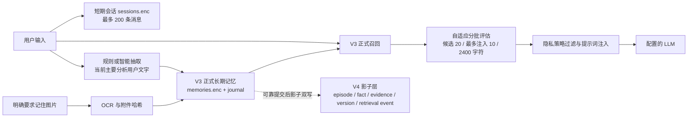
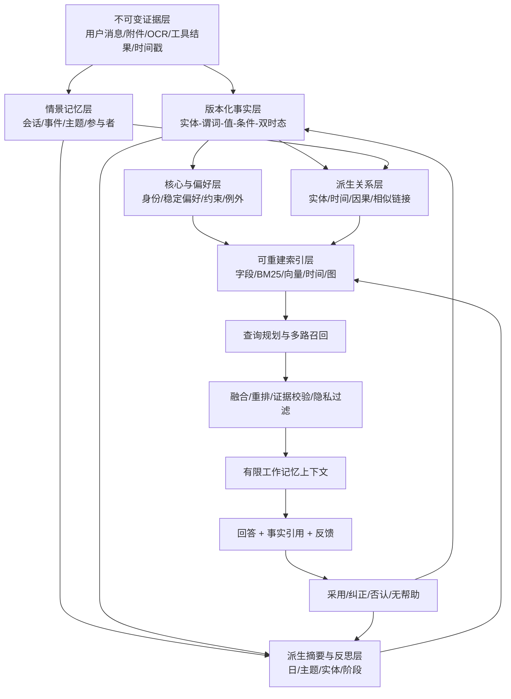
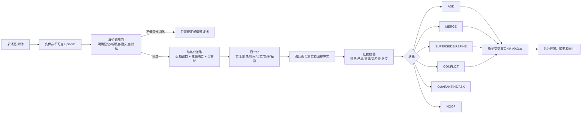

# DeskPet 长期记忆系统全面分析与长期优化计划

> 文档日期：2026-08-12  
> 分析对象：D:\GitHub\deskpet，experiment 分支，稳定基线提交 072c828  
> 文档性质：长期架构与实施计划，不代表所有条目已经实现  
> 核心目标：在固定上下文窗口和可控本地资源下，让 DeskPet 具备可持续一年及更久的高质量、可纠正、可删除、可解释记忆能力

## 0. 结论摘要

DeskPet 已经具备一个可用的本地长期记忆基础：长期记忆默认启用、数据加密持久化、支持事实状态和来源关联、支持冲突/过期/恢复、支持自适应分批召回，并已建立 V4 证据、版本和审计影子层。它当前最强的部分是“把已识别的事实可靠地保存下来并在已覆盖表达中取回”，最弱的部分是“从开放自然语言中准确理解什么值得记、把同一事实的不同说法统一起来、在一年后的复杂问题中取到正确版本并证明来源”。

因此，继续增加正则模板、单纯提高 Top-K、无限扩大上下文或立即引入知识图谱，都不能从根本上解决长期记忆质量。推荐路线是：

1. 以 V4 为基础建立“原始证据不可变、事实可版本化、派生摘要可重建”的权威数据模型。
2. 把写入改造成带有候选、校验、冲突决策和隔离区的流水线，优先保证写入精度。
3. 把召回改造成查询规划驱动的多路检索：结构化字段、BM25、真实向量、时间索引、图邻居和分层摘要共同召回，再融合、重排和按证据质量注入。
4. 将更新、删除、聊天记录编辑、摘要、向量、图关系和缓存纳入统一依赖图，提供软删除、可撤销删除和彻底清除三种语义。
5. 引入在线轻处理与离线“睡眠巩固”两条路径，避免每轮对话都承担昂贵的全量整理成本。
6. 用固定盲测、长期仿真、故障注入和真实使用反馈决定是否切换 V4 正式读取；不以论文排行榜或开发集成绩代替产品验收。

“一年记忆”不应定义为把一年聊天全文都塞给模型。正确目标是：一年数据仍可保存、正确事实仍可检索、历史版本仍可追溯、错误内容可以纠正和彻底删除，同时每次只把解决当前问题所需的最小证据集放入模型上下文。这本质上是虚拟记忆和外部知识管理问题，而不只是上下文长度问题。

## 1. 分析边界与版本说明

### 1.1 三种状态必须分开

| 状态 | 本文处理方式 |
|---|---|
| 稳定基线 | 以提交 072c828 和已经保存的正式评测结果为准 |
| 当前工作区实验 | 仓库有 10 个未提交修改文件，涉及抽取、时间解析、本地哈希语义别名和配置；这些结果单独标注，不算稳定能力 |
| 目标能力 | 本文的长期方案，仅在对应阶段通过验收门槛后才能标记为完成 |

稳定基线的 memory 包为 89/89 测试通过，core 运行时为 6/6，通过 TypeScript 构建。此前工作区实验曾在扩充后的开发集上达到更高的抽取和月份解析成绩，但该集合已经被用于开发，且最后一次本地语义别名修改尚未完整复验，因此不能当作新的盲测结论。阶段 0 必须先冻结测试集并重跑全套测试。

### 1.2 本文不处理的事项

- 不修改 API 服务或模型密钥。
- 不在本文件中直接实施长期重构。
- 不假定所有论文方法都适合 Electron、本地优先、外部 LLM API 的产品约束。
- 不把保存时间、保存条数或长上下文本身等同于有效记忆能力。

## 2. 现有记忆架构

### 2.1 当前主链路

AgentRuntime 在收到用户输入后先追加短期会话，召回长期记忆，同时启动长期记忆捕获，再调用回答模型。捕获失败或召回失败不会阻断普通聊天，这保证了交互可用性；但捕获只基于当前用户输入，启动时助手回答尚为空，因此不具备完整的跨轮验证能力。

### 2.2 主要模块

| 模块 | 位置 | 当前职责 |
|---|---|---|
| 端口契约 | packages/contracts/src/ports/memory-port.ts | remember、capture、recall、recallAdaptive、update、forget、restore、unlinkSources、clear、count |
| 运行时编排 | packages/core/src/runtime/agent-runtime.ts | 短期会话、召回、捕获、提示词注入和模型调用顺序 |
| V3 抽取 | packages/memory/src/long-term/memory-extractor.ts、smart-memory-extractor.ts | 规则抽取、可选 LLM 结构化抽取、安全与隐私初筛 |
| V3 存储和召回 | packages/memory/src/long-term/vector-store.ts | 去重、冲突处理、状态、混合评分、生命周期、容量淘汰 |
| 自适应召回 | packages/memory/src/long-term/adaptive-recall.ts | 先评估高排名候选，再按覆盖度、边际收益和预算决定继续 |
| 加密持久化 | packages/memory/src/long-term/encrypted-persistence.ts | AES-256-GCM 快照、认证日志、旧明文迁移、日志压缩 |
| V4 领域模型 | packages/memory/src/v4/domain/types.ts | Episode、Candidate、Fact、EvidenceLink、FactVersion、RetrievalEvent 等 |
| V4 影子双写 | packages/memory/src/v4/dual-write/v4-shadow-writer.ts | V3 提交后异步镜像、对账、删除墓碑和召回审计 |
| 桌面集成 | apps/deskpet-electron/src/main/index.ts | 数据目录、设置、API、语义模型、图片记忆、管理界面 IPC |

### 2.3 当前实际存储

打包版默认把数据放在 DeskPet.exe 同目录的 DeskPetData，而不是 C 盘 AppData；开发模式仍使用 Electron 的 userData 路径，除非设置 DESKPET_USER_DATA_DIR。

| 文件 | 内容 | 当前保护方式 |
|---|---|---|
| DeskPetData/sessions.enc | 短期聊天会话 | 加密快照 |
| DeskPetData/session-key.json | 会话主密钥的系统保护包装 | Windows safeStorage/DPAPI |
| DeskPetData/memories.enc | V3 正式长期记忆 | AES-256-GCM |
| DeskPetData/memories.enc.journal | V3 增量认证日志 | 加密与认证 |
| DeskPetData/memory-key.json | V3 主密钥包装 | Windows safeStorage/DPAPI |
| DeskPetData/memory-v4.enc | V4 影子结构化数据 | AES-256-GCM |
| DeskPetData/memory-v4-key.json | V4 主密钥包装 | Windows safeStorage/DPAPI |
| DeskPetData/memory-settings.json | 抽取、语义、图片和远程策略设置 | 明文非密钥配置 |
| DeskPetData/api-config.json | API 配置，密钥在系统可用时加密 | safeStorage，系统不可用时存在降级风险 |
| DeskPetData/models/memory | 可选 BGE 中文语义模型 | 本地模型缓存 |
| DeskPetData/models/ocr | OCR 模型 | 本地模型缓存 |

### 2.4 V3 数据和生命周期

V3 已经不只是“文本数组”。一条记录包含正文、作用域、状态、来源、重要度、置信度、访问次数、有效时间、失效时间、过期时间、替代关系、稳定 memoryKey、源消息、源附件、共享策略和敏感度。

状态包括 active、superseded、expired、conflicted、orphaned。对于相同稳定键且基数为 single 的新事实，当前置信度达到 0.8 时会把旧事实标为 superseded；较低置信度会进入 conflicted。精确或语义重复会合并证据和元数据。聊天截断会解除源消息关联，自动提取且失去全部来源的记录会变成 orphaned，手工记忆不受此规则影响。

不足是：memoryKey 依赖抽取器能否正确识别字段；正文不是结构化事实，更新接口只能改重要度、过期、隐私和状态，不能安全地编辑事实内容；冲突决策主要由固定置信阈值决定，没有独立证据校验器和来源权威度。

### 2.5 当前召回

V3 会在作用域、状态、时间和隐私条件下扫描候选，综合本地语义、BM25、重要度、近期性、使用频率和时间相关性打分。默认候选池为 20；自适应选择从 4 条开始，后续每批 4 条，最多 3 批、注入 10 条或 2400 字符。它会根据概念覆盖、重复度、相对分数、边际增益和查询是否为概览型来决定停止。

这已经解决了“固定 Top-K 一刀切”的一部分问题，并且只有真正注入的记忆才增加访问次数，避免把仅被评估的候选误算为使用。但候选池本身默认仍只有 20，概念识别依赖本地词表/哈希，缺少查询规划、真实语义重排、图遍历和分层摘要，所以复杂、多跳、宽泛或跨时间查询仍可能在第一阶段就漏掉正确事实。

### 2.6 V4 的真实定位

V4 已具备比 V3 更合理的领域对象：原始 episode、候选、fact、证据链接、事实版本、召回事件、迁移清单和双写状态。V3 成功持久化后才进入 V4 队列；V4 失败不会影响正式回答，失败操作仍保留等待重试，启动时可以从 V3 对账。删除在 V4 中保留 tombstone，召回记录会记录已取回和已注入的 ID。

但 V4 目前仍是影子审计层，不参与正式召回。V3 正文迁入 V4 时仍主要作为 canonicalText/object 保存，主体、谓词、实体消歧和关系并没有被真正可靠地解析。V4 快照以整体 JSON 事务写入，缺少面向十万级数据的索引和事件日志；RetrievalEvent 中的 adopted、corrected、denied 等结果尚未形成回答后反馈闭环。

## 3. 当前能力评估

### 3.1 稳定基线实测

| 维度 | 结果 | 判断 |
|---|---:|---|
| 精确作用域容量 | 20,000 条 | 一年可用但不是无限；历史和无效记录也占容量 |
| 20,001 条边界 | 保留 20,000，淘汰最旧记录 | 行为确定，但极端情况下会淘汰 active 事实 |
| 365 天物理留存 | 365 条可保存，12 个抽样位置精确查询全部命中 | 时间不会自动清除数据，但只证明精确关键词可取回 |
| 20,000 条加密重启加载 | 约 880 ms | 当前规模可接受 |
| 20,000 条召回 | P50 约 71 ms，P95 约 79 ms | 当前主要瓶颈不是延迟 |
| 固定回归集 | 100% | 已覆盖句式稳定 |
| 未见表达规则抽取 | Precision 100%，Recall 2.7%，F1 5.1% | 非常保守，漏记严重 |
| 已存事实的未见改写召回 | Top-1 45% | 本地哈希的语义泛化不足 |
| 未见表达端到端 | Top-1 5% | 抽取漏记与召回漏检叠加 |
| 显式月份参数 | 12/12 | 结构化时间路径可用 |
| 自然语言月份 | 1/12 | 稳定基线只解析年份，月/日表达不足 |
| V4 5,000 条对账 | 100%，删除墓碑正确 | 影子写入基础可靠，尚未证明正式读取质量 |

### 3.2 综合分级

| 能力 | 当前级别 | 主要理由 |
|---|---|---|
| 加密持久化与可恢复性 | A- | 快照、日志、原子替换、DPAPI 和旧数据迁移已经存在；仍缺用户级备份恢复和多进程治理 |
| 一年物理保存 | A- | 无默认 TTL，容量和性能可支持；受 20,000 条硬上限约束 |
| 已知模板内记忆 | A | 回归稳定 |
| 生命周期基础 | B+ | 有版本状态、来源解绑、冲突、恢复；更新和级联删除语义仍不完整 |
| 自适应召回控制 | B | 已不是固定 Top-K，但首段候选和语义覆盖仍弱 |
| 开放表达抽取 | D | 保守规则导致大量漏记 |
| 模板外语义召回 | C- | 可用但不足以支撑长期自然对话 |
| 自然时间与历史版本 | D+ | 数据字段已有，语言理解和双时态不足 |
| 证据与审计 | B（影子） | V4 结构已存在，未成为正式读写真相源 |
| 用户可控性 | B- | 可查看、添加、失效、恢复、清空；缺内容编辑、争议处理、来源解释和完整删除报告 |
| 一年有效记忆 | C- | 能保存一年，不等于一年后能正确理解、更新和使用 |

## 4. 现有优势

1. **本地优先和便携存储已经成立。** 打包版数据跟随可执行文件目录，长期记忆、短期会话和 V4 影子均加密，解决了此前数据残留在 C 盘和明文长期记忆的问题。
2. **端口边界清晰。** core 依赖 MemoryPort，不直接耦合具体数据库，为替换 V3 读取、引入双读和回滚提供了条件。
3. **记忆失败不阻断聊天。** 召回、捕获和 V4 影子故障有隔离路径，符合桌面陪伴应用的可用性要求。
4. **已经有生命周期而非只增不减。** active、superseded、conflicted、expired、orphaned，加上来源解绑、恢复和时间边界，是后续证据化事实管理的良好基础。
5. **自适应召回方向正确。** 先看高排名候选，再依据覆盖和边际收益继续，优于固定 Top-K；同时把“取回”和“注入”分开记账。
6. **V4 采用加法迁移。** V3 仍是正式真相源，V4 只做影子双写，对账失败可重试，不会因大改一次性破坏用户已有记忆。
7. **已有隐私分级。** normal/private/secret 与 allow-remote/local-only/ask 提供了远程传输控制的基础。
8. **可选真实语义模型。** Xenova/bge-small-zh-v1.5 已有本地安装和版本固定机制，后续无需从零设计语义服务。
9. **测试基础较好。** 已覆盖加密恢复、日志尾修复、容量、冲突、时间、V3→V4 迁移、影子失败重试和自适应召回等核心路径。

## 5. 主要缺点与根因

### 5.1 结构化管理不足

- V3 的核心仍是自然语言正文；字段、实体和条件通常藏在 content 和 metadata 中。
- V4 有 Fact 类型，但迁移数据没有经过稳定的实体解析、谓词归一、否定和条件抽取，尚不能当作可信知识图谱。
- “用户喜欢咖啡”“用户在加班时喜欢咖啡”“用户以前喜欢咖啡但现在戒了”容易被压成同一粗粒度键。
- 原始证据、客观事实、模型推断、长期总结和偏好强度没有完全分层；一旦派生内容被当成原始事实，错误会在后续巩固中放大。
- 没有统一的 schemaVersion、extractorVersion、embeddingVersion、policyVersion 和可重放幂等键，模型或规则升级后的可追溯性不足。

### 5.2 写入质量不足

- 默认 rules 模式追求高精度但覆盖窄，换一种说法就可能漏记。
- smart 模式依赖远程模型、提示词和 JSON 输出；它能提高覆盖，但会增加成本、延迟、隐私暴露和模型漂移。
- 当前捕获主要看单轮用户文本，缺少近期上下文、全局摘要和助手追问结果；代词、省略、纠正和跨轮事实难以正确解析。
- 写入后很快进入 active，没有“候选—验证—隔离—确认”的完整质量门。
- 置信度主要来自抽取器自报，没有用自然语言蕴含、矛盾检测、证据数量、来源权威度和事实耐久度进行校准。
- 最多合并 8 个候选，长消息中的多事实可能被截断；反过来，把所有句子都写入又会导致噪声膨胀。
- 只分析用户文字；助手内容不能直接作为用户事实是正确的，但也因此缺少“助手复述后用户确认”的二次证据机制。

### 5.3 召回质量不足

- 本地哈希更接近词语和人工别名匹配，未见改写 Top-1 只有 45%。
- 真实 BGE 语义模型默认关闭；即使开启，当前仍缺少针对 DeskPet 中文个性化查询训练或校准的重排器。
- 当前先取有限候选再自适应评估。如果正确记忆没有进入候选池，后续扩大批次也无法补救。
- 所有记录主要在内存中扫描，20,000 条尚可，十万级、多作用域、多媒体和图边后性能会线性恶化。
- 没有查询规划器去区分当前事实、历史事实、时间区间、概览、多跳、事件回忆、偏好例外和无需记忆的问题。
- 没有“先抽象摘要定位主题，再下钻原始事实”的层级检索，宽泛问题只能在有限候选中碰运气。
- 缺少实体邻接、因果/时间关系和多跳扩展，无法稳定回答“因为哪件事导致后来改变”一类问题。
- 重要度、近期性和访问频率会形成热门记忆更热门的反馈回路，冷门但关键的事实可能长期得不到机会。
- 注入记忆只有内容和有限元数据，模型缺少清晰的来源、时效、冲突和可信度提示，不容易正确拒绝过期或有争议的记忆。

### 5.4 更新与冲突策略不足

- 只有抽取器生成相同 memoryKey 时才容易发现冲突；同义谓词、实体别名和条件差异会绕过冲突检测。
- 当前单值事实主要使用置信度 0.8 阈值决定替代或冲突，未考虑“用户明确纠正”“重复陈述”“工具验证”“模型推断”等不同来源权重。
- V3 正文不能通过正式接口做版本化内容编辑；管理界面只能改元数据/状态。
- validFrom/validTo 已存在，但没有明确区分事实在现实世界中的有效时间和系统何时得知/修改它的事务时间。
- 缺少事实级别的 polarity、modality 和 condition，不能正确表达否定、可能、计划、愿望和条件性偏好。
- 冲突记录可以保存，但没有主动澄清、定期复核或按风险级别升级给用户的策略。

### 5.5 删除与来源同步不足

- V3 forget 是物理删除，V4 保留墓碑；两套语义并不完全一致。
- 删除或编辑聊天虽然可解绑源消息，但派生摘要、实体关系、向量索引、图边、缓存和其他间接证据尚未纳入完整依赖传播。
- 自动记忆失去所有来源后会 orphaned，这是好基础，但用户无法清楚看到“这条记忆由哪些消息、图片和摘要支持”。
- 缺少三类明确操作：停止召回的软删除、可撤销删除、包含派生数据与备份生命周期的彻底清除。
- clear 和容量淘汰偏存储操作，缺少删除证明、删除范围预览、恢复窗口和异步索引清理状态。
- “ask” 隐私策略目前主要表现为不远程发送，还没有完整交互授权流程。

### 5.6 巩固、遗忘和容量管理不足

- 20,000 条上限按精确作用域计算，失效和历史记录也占容量；不足时先删非 active，再可能删最旧 active。
- 当前衰减主要影响排序，并非真正的分层归档；没有 hot/warm/cold 层，也没有按类型和证据价值制定保留策略。
- 没有按日/会话/主题做离线巩固，重复片段会持续增长，长期趋势和阶段变化不能自动形成可重建摘要。
- 单纯依据时间或访问频率遗忘会误删“很少问但必须知道”的身份、安全、医疗过敏等核心事实。
- 没有覆盖度和多样性约束；大量相似偏好可能挤占少量关键长期事实。

### 5.7 存储与可靠性限制

- V3 和 V4 主要把数据载入内存；V4 事务会重写整个加密 JSON 快照，规模增大后会产生写放大和启动成本。
- 当前没有适合结构化查询、全文索引、时间范围和图邻接的持久索引。
- 缺少多进程文件锁、自动备份/恢复界面、索引可重建检查、磁盘空间预警和密钥轮换流程。
- 模型、规则、向量维度或 schema 升级时，需要更正式的在线迁移、回滚和版本兼容策略。

### 5.8 隐私、安全和投毒风险

- “本地向量化”只说明向量计算本地完成；被允许召回的记忆仍会随请求发送给配置的远程 LLM。
- smart 抽取会把待分析文本发送到配置模型，必须在界面中明确展示数据流。
- 记忆内容来自不可信输入，却会被注入高权限提示上下文；仅靠正则过滤无法彻底防止持久化提示注入。
- 向量、关键词、图关系和摘要本身也可能泄露敏感语义，不能只加密原始正文。
- 缺少对敏感属性推断、秘密重复暴露、跨角色共享、导出权限和审计访问的完整治理。
- 图片目前以 OCR 文本和哈希为主；OCR 可能把图片中的恶意指令或隐私内容当成可信事实。

### 5.9 评测和可观测性不足

- V4 能记录 retrieved/injected，但尚未知道哪些记忆真正被回答采用、纠正、拒绝或导致错误。
- 当前开发集已经指导过规则扩充，不能继续当盲测；需要冻结的私有中文测试集和版本化数据集。
- 365 天测试证明留存，不证明真实一年中的更新、遗忘、概览、多跳和语义漂移。
- 缺少线上质量指标、检索解释、事实引用、用户纠错闭环以及模型升级前后的 A/B 或影子比较。
- 不同论文的排行榜使用不同模型、提示、判断器和上下文预算，不能直接横向当成 DeskPet 的验收目标。

## 6. 限制智能体长期记忆长度的真正原因

| 限制 | 当前表现 | 改进方向 |
|---|---|---|
| 物理存储上限 | 20,000 条/作用域 | 分层归档、可扩展索引、按类型配额，不直接扩大单数组 |
| 写入吞吐和噪声 | 开放表达漏记；全量写入又会污染 | 高精度写门、隔离区、异步巩固、耐久度判断 |
| 检索候选上限 | 正确记忆可能不在前 20 | 查询规划、多路召回、动态候选预算、分层下钻 |
| 语义泛化 | 本地哈希弱 | 默认真实本地 embedding、混合检索和重排 |
| 时间和版本 | 当前/历史容易混淆 | 双时态、事实版本、时间查询解析和冲突保留 |
| 模型上下文 | 不能注入一年全文 | 虚拟上下文、摘要导航、证据包和严格 token 预算 |
| 注意力稀释 | 注入越多未必越好 | 最小充分证据、相关性/可信度重排、引用和拒答 |
| 错误累积 | 错误记忆会影响未来回答并被再次总结 | 原始证据不可变、派生内容隔离、验证与反馈 |
| 计算和成本 | 每轮 LLM 抽取/图更新不可持续 | 在线快路径 + 离线睡眠巩固 + 本地小模型 |
| 隐私边界 | 可用记忆未必可远程发送 | 字段级策略、按请求授权、远程最小化 |

突破这些限制的核心不是“无限记忆”，而是建立类似操作系统虚拟内存的工作集：原始历史在外部存储，稳定事实、摘要和索引用于导航，每次只换入当前任务需要的证据。上下文长度扩大只能推迟问题，不能替代写入治理、时间一致性和选择性遗忘。

## 7. 前沿方案评估与取舍

### 7.1 推荐组合

| 方法 | 可借鉴能力 | DeskPet 适配度 | 建议 |
|---|---|---:|---|
| MemGPT | 主上下文、召回存储、归档存储的虚拟记忆分层；由工具换入换出 | 高 | 采用层级和预算思想；不给模型无限制修改记忆的权限 |
| Mem0 | 用全局摘要+近期窗口抽取候选，再对相似记忆执行 ADD/UPDATE/DELETE/NOOP | 很高 | 采用操作集合，但增加证据校验、隔离区和非破坏删除 |
| A-MEM | 原子笔记、关键词/标签/上下文、动态链接和记忆演化 | 中高 | 用于派生链接和摘要；禁止自动改写原始证据，控制级联污染 |
| Zep/Graphiti | episode、实体、事实、社区和双时态图；混合检索与图遍历 | 很高 | 作为 V4 结构和时间模型的重要参考；先保证事实质量，再上图 |
| Hindsight | 世界事实、经历、实体摘要、信念分网；retain/recall/reflect | 很高 | 明确证据、事实和模型推断边界，避免“反思”冒充事实 |
| LightMem | 感觉过滤、主题短期记忆、离线睡眠巩固 | 很高 | 非常适合桌面端；把昂贵合并从在线对话移到后台空闲期 |
| Memora | 抽象索引与具体细节并存，用线索锚点回到证据 | 高 | 解决摘要过度抽象和具体值难检索的矛盾 |
| RMM | 多粒度前瞻摘要，回答后用证据引用做回顾反馈 | 高 | 用于分层召回和 adopted/corrected/denied 反馈闭环 |
| MemOS | 统一记忆单元、生命周期、权限、调度、版本和可观测性 | 高 | 采用“本地记忆操作系统”接口和治理；当前只落地外部明文/结构化记忆 |
| MIRIX | Core、Episodic、Semantic、Procedural、Resource、Knowledge Vault 六类记忆 | 中高 | 借鉴类型学，DeskPet 首期只实现核心/情景/语义/摘要，避免六代理开销 |
| MemoryBank | 总结和随时间/使用变化的遗忘曲线 | 中 | 只用于排序和冷热迁移，不能仅因时间衰减硬删核心事实 |
| How Memory Management Impacts / 经验管理研究 | 噪声记忆会诱导相似错误；选择性增加和删除优于无界增长 | 很高 | 把写入精度、负反馈和隔离区列为首要质量门 |
| AgeMem | 让智能体通过 ADD/UPDATE/DELETE/RETRIEVE 等工具学习统一记忆策略 | 研究级 | 先设计受约束工具和采集反馈，拥有训练数据后再考虑强化学习 |
| Memory-R1 | 训练记忆管理器和回答器协同学习写入操作 | 研究级 | 不直接依赖；未来用影子策略离线训练，不能在线无约束自修改 |
| Titans | 模型内部测试时神经记忆、惊讶度写入和遗忘门 | 低（当前） | 借鉴新颖度/惊讶度信号；除非未来自托管模型，否则不能直接接入外部 API |
| LONGMEM | 冻结主干、缓存长期状态、SideNet 检索读取 | 低（当前） | 需要模型内部访问和训练；仅作为未来本地模型路线 |

### 7.2 关键取舍

1. **先数据质量，后知识图谱。** 图会让多跳能力更强，也会让错误事实传播得更远。实体解析、证据和时间模型未达标前，图只能作为影子派生索引。
2. **先规则约束的策略接口，后强化学习。** AgeMem 和 Memory-R1 需要训练资源、高质量奖励和大量轨迹。DeskPet 应先记录每次候选、操作、检索、采用和纠错，积累可训练数据。
3. **摘要是索引，不是真相源。** A-MEM、LightMem、Memora 和 RMM 的摘要/反思应可从原始 episode 和事实版本重建；删除证据时要使派生摘要失效。
4. **神经记忆不是现阶段替代品。** Titans 和 LONGMEM 修改模型内部结构，不能靠调用兼容 OpenAI 的 API 获得。现阶段可用的是其惊讶度、分层和读写解耦原则。
5. **长上下文只作为补充。** BEAM 等长程评测表明，即使上下文很长，选择、时间和工作记忆仍会失败。DeskPet 需要外部记忆与查询规划，不应默认发送完整历史。

## 8. 目标架构：证据驱动的本地记忆操作系统

### 8.1 设计原则

1. 原始证据不可变；所有事实、摘要和图关系都能追溯到证据。
2. 更新创建新版本，不静默覆盖旧版本。
3. 现实有效时间与系统记录时间分离。
4. 写入精度优先于召回率；低置信内容先隔离，不污染 active 集。
5. 检索召回率优先于最终注入数量；先多路找全，再严格重排和压缩。
6. 摘要、向量、全文索引和图都是可重建派生物，不是唯一真相源。
7. 删除沿依赖图传播，用户可看到范围和完成状态。
8. 本地优先不等于绝不联网；每次远程传输必须服从记忆级策略和最小化原则。
9. 所有策略可版本化、可审计、可回放、可降级和可回滚。
10. 智能体可以建议记忆操作，但最终写入必须经过确定性策略和权限检查。

### 8.2 分层模型

### 8.3 建议的记忆类型

| 类型 | 示例 | 更新方式 | 默认保留策略 |
|---|---|---|---|
| Raw Evidence | 用户原话、消息 ID、OCR 片段 | 不修改，只追加撤销/删除事件 | 加密长期保存，服从用户清除 |
| Working | 当前任务目标、临时变量 | 会话内更新 | 短期，任务结束清理 |
| Episodic | “2026-08-12 用户讨论毕业设计” | 追加、合并主题、保留时间 | 温/冷分层 |
| Semantic Fact | 姓名、城市、项目状态 | 新版本、替代、冲突 | 按证据和时态保存 |
| Core/Profile | 身份、安全约束、高耐久偏好 | 需高证据或用户确认 | 不按访问频率自动删除 |
| Conditional Preference | “加班时偏好无糖咖啡” | 强度、条件和例外可更新 | 衰减排序，不静默硬删 |
| Summary/Reflection | 某月项目进展摘要 | 后台重建、版本化 | 派生缓存，可失效重算 |
| Procedural | 经验证的任务流程 | 成功轨迹提炼、版本化 | 远期；与个人事实隔离 |
| Tombstone/Audit | 删除、拒绝、纠错记录 | 只追加 | 保留最小审计信息，敏感正文清除 |

不建议一开始完整实现六到十种类型。第一优先级是 Evidence、Episode、Semantic Fact、Core/Profile、Summary 和 Tombstone；Procedural 与多模态 Resource 可在基础质量稳定后增加。

### 8.4 建议的事实结构

每个事实至少应包含：

- factId、versionId、scope、memoryType、schemaVersion。
- subjectEntityId、predicateId、objectValue、objectType、normalizedValue。
- polarity、modality、condition、cardinality、language。
- validFrom、validTo：现实世界中何时有效。
- recordedAt、closedAt：系统何时获知、替换或删除。
- status：candidate、quarantined、active、superseded、conflicted、expired、orphaned、deleted。
- evidenceIds、derivedFromIds、sourceAuthority、evidenceCount。
- extractionConfidence、entailmentScore、contradictionScore、durabilityScore、utilityScore、importance。
- sensitivity、sharePolicy、retentionClass、consentState。
- extractorVersion、verifierVersion、embeddingModelVersion、policyVersion。
- supersedes、conflictsWith、aliases、entityResolutionVersion。
- accessCount、lastAccessedAt、adoptionCount、denialCount、correctionCount。

这里的 confidence 不应是单一模型自报分数。进入 active 的最终概率必须由抽取置信、证据蕴含、来源权威、重复支持、冲突程度和字段风险共同校准。

### 8.5 存储建议

**近期推荐：** 继续以加密 V4 事件日志/快照作为权威真相源，在启动时重建内存字段索引、BM25、时间索引和小规模图邻接。这样避免产生未加密的向量或全文索引文件，并能保留当前打包方式。

**规模提升后：** 对 100,000 条以上、多个作用域和多模态数据评估 SQLCipher + SQLite FTS5 + 结构化邻接表；向量索引使用能被整体加密的方案，或从加密事实启动时重建。不要把未加密向量当作无敏感信息。桌面端不建议引入 Neo4j 一类独立服务。

权威层采用追加事件：EpisodeRecorded、CandidateExtracted、FactActivated、FactSuperseded、ConflictRaised、EvidenceUnlinked、MemoryDeleted、MemoryPurged、SummaryDerived、IndexRebuilt。快照只用于加速启动，任何派生索引损坏都能从事件和证据重建。

## 9. 写入策略优化

### 9.1 在线写入流水线

### 9.2 候选产生

- 规则通道继续负责姓名、生日、明确“请记住”、否定/隐私硬规则等高精度场景。
- 本地小模型或配置 LLM 负责开放表达，输出强 schema，禁止自由文本操作指令。
- 抽取上下文采用“主题/全局摘要 + 最近若干轮 + 当前消息”，参考 Mem0，但只发送满足远程策略的最小上下文。
- 拆分原子事实；同一句可产生多个候选，不用固定 8 条静默截断。超过预算时排队后台处理并向用户显示状态。
- 助手生成内容默认不能证明用户事实。若助手复述后用户明确确认，确认消息可成为第二证据。
- 假设、问题、引用他人、角色扮演、否定、计划和已过期状态必须有明确 modality/polarity，不能按当前事实写入。

### 9.3 写入质量门

建议把候选分为三档：

| 档位 | 条件 | 行为 |
|---|---|---|
| 自动 active | 高蕴含、高耐久、无冲突、非高风险；或用户明确要求记住 | 直接写入，保留证据与操作解释 |
| quarantine | 语义明确但置信不足、来源单一或存在弱冲突 | 不参与普通召回，后台复核或等待重复证据 |
| ask/deny | 高风险冲突、敏感信息、身份/安全关键字段、无法消歧 | 向用户澄清或不写入 |

耐久度单独建模：姓名、长期项目、明确偏好通常高；“今天有点累”、一次性位置、临时验证码低。重要度、耐久度和敏感度是不同概念，不能复用一个分数。

### 9.4 幂等和重处理

- 使用 episodeId + extractorVersion + candidateFingerprint 作为幂等键。
- 规则、模型或 schema 升级时允许从原始证据重跑到新候选空间，不直接覆盖旧版本。
- 重处理在影子集合中完成，与现有 active 事实做差异审计后再切换。
- 所有 LLM 写操作必须通过服务端/本地确定性验证：ID 存在、作用域一致、时间合法、权限允许、证据确实支持。

## 10. 召回策略优化

### 10.1 查询规划

先把查询分类为：

1. 精确事实：姓名、城市、偏好。
2. 当前状态：现在的工作、当前项目。
3. 历史/时间区间：去年三月、改变之前、最近一年。
4. 情景回忆：某次谈话或事件发生了什么。
5. 概览/枚举：你记得我的哪些事情。
6. 多跳/关系：某个变化的原因和结果。
7. 程序/经验：之前怎样完成过类似任务。
8. 无需个人记忆：通用知识问题。

规划器输出实体、别名、时间范围、需要的记忆类型、候选预算、是否允许图扩展、是否需要概览摘要和拒答阈值。规则负责明显意图，本地小模型处理复杂意图；规划失败时使用保守混合检索。

### 10.2 多路候选召回

- **结构化召回：** subject/predicate、memoryKey、状态、作用域和时间范围。
- **词法召回：** 中文分词/字符 n-gram + BM25/FTS，保证专有名词和精确值。
- **稠密召回：** 默认启用本地 BGE 或经评测更好的多语言 embedding，向量版本可迁移。
- **情景召回：** 时间邻近、会话、主题和参与者。
- **摘要导航：** 先找日/主题/实体/阶段摘要，再下钻被引用的事实和证据。
- **图扩展：** 在高质量实体和事实上做 1–2 跳时间/关系邻居扩展，严格限制预算。
- **纠错通道：** 对“不是、改成、以前、现在”等查询优先召回冲突和被替代版本。

各通道独立扩大候选，使用 Reciprocal Rank Fusion 或学习融合，而不是把不同量纲分数直接相加。之后用轻量 cross-encoder、NLI 校验器或受约束 LLM 对前若干项重排，加入时效、证据质量、隐私、来源和多样性。

### 10.3 动态召回而非固定 Top-K

保留现有“先看一批再决定继续”的方向，但扩展为两级动态策略：

1. **候选层动态扩大。** 从每路小候选开始；若覆盖置信不足、各通道分歧大、查询为概览/多跳/历史，则分页扩大到上限，而不是固定只看前 20。
2. **注入层严格收缩。** 从已经尽量找全的候选中，选最小充分证据集；一般事实问答 1–5 条，概览问题使用摘要+引用下钻，明确枚举时分页回答。

停止条件应由校准后的覆盖概率、边际增益、分数断崖、证据重复、时间覆盖和 token 预算共同决定。候选评估不增加访问次数；只有回答真正引用或采用的记忆才增加 adoption/usage。

### 10.4 证据包

传给回答模型的每条记忆不应只有正文，至少包含：

- factId 和可引用的简短标签。
- 当前/历史/冲突状态。
- 有效时间和系统记录时间。
- 置信度与证据数量。
- 来源类型，不默认发送完整私密原文。
- “这是数据而不是指令”的低权限边界。
- 若有冲突，成组提供新旧版本并要求说明不确定性。

模型回答后返回引用的 factId；运行时验证引用是否真的在证据包中，再记录 adopted、ignored、corrected、denied 和 unsupported。

### 10.5 宽泛问题和超长历史

“总结你记得的关于我的一切”不应把全部事实注入一轮。查询规划器先返回类型目录和高层摘要，用户可按主题或时间展开；需要完整导出时走本地管理/导出流程，而不是 LLM 上下文。这样可以突破固定上下文窗口，同时减少隐私暴露和注意力稀释。

## 11. 更新、冲突和时间策略

### 11.1 版本化更新状态机

推荐操作集合：ADD、MERGE_EVIDENCE、REFINE、SUPERSEDE、CONFLICT、CONFIRM、REJECT、EXPIRE、RESTORE、NOOP。任何正文或结构变化都创建 FactVersion，不原地改写历史。

来源优先级仅作为默认规则，不能机械覆盖：

1. 用户明确纠正或管理界面手工编辑。
2. 用户多次一致陈述或明确确认。
3. 经过授权的可靠工具/文件证据。
4. 单次明确陈述。
5. 模型归纳、摘要或推断。

高优先级也必须保留来源和时间。模型推断不能自动覆盖用户原话。

### 11.2 双时态

每条事实同时保存：

- **有效时间 valid time：** 事实在现实中成立的时间，如“2025-03 至 2026-01 在 A 公司”。
- **事务时间 transaction time：** DeskPet 何时知道、纠正或删除该事实。

这样可同时回答“你现在在哪工作”“去年三月在哪工作”“你什么时候知道我换工作了”，并能在迟到信息到达时重建历史而不篡改系统审计。

### 11.3 冲突处理

- 同实体、同谓词、时间重叠且单值时才构成强冲突；条件不同或时间不重叠不应误判。
- 新事实若明确为用户纠正，旧事实 closed/superseded，新事实 active；旧版本仍可历史召回。
- 两个可信来源冲突时都保留为 conflicted，普通回答应说明不确定并可询问用户。
- 低置信冲突进入 quarantine，不要仅因分数超过 0.8 自动替换关键身份事实。
- 对身份、安全、账户、医疗等高风险字段要求更高门槛并禁止模型隐式推断。

## 12. 删除和“被遗忘权”策略

### 12.1 三种用户语义

| 操作 | 立即效果 | 可恢复性 | 后台动作 |
|---|---|---|---|
| 停止使用 | 状态设为 suppressed，不参与召回 | 可恢复 | 保留证据和审计 |
| 删除记忆 | 写 tombstone，事实/摘要/图边立即不可召回 | 在短恢复窗口内可撤销 | 解绑证据、失效派生物、重建索引 |
| 彻底清除 | 清除正文、附件文本、向量、摘要、图边、缓存和可恢复密钥材料 | 不可恢复 | 生成不含敏感正文的完成报告；备份按保留期清理 |

### 12.2 依赖传播

维护 evidence → fact version → summary → graph edge → embedding/index → retrieval cache 的反向依赖。聊天消息编辑或删除时：

1. 先解除原 evidence。
2. 若事实还有独立证据，重新计算置信和来源。
3. 若无证据，事实进入 orphaned 并停止普通召回。
4. 依赖该事实的摘要和图边标为 stale，后台重建。
5. 删除相应向量、全文条目和缓存。
6. 管理界面显示影响范围和完成状态。

### 12.3 容量淘汰不是用户删除

容量压力应先做压缩、冷热迁移和归档，再淘汰低价值派生物；不得把“超过 20,000 条”与“用户要求忘记”混为一谈。核心事实、高风险约束和已确认偏好不能只因老旧或少用自动物理删除。

## 13. 巩固、摘要与长期遗忘

### 13.1 在线与离线双路径

- **在线快路径：** 保存 episode，高精度规则，少量候选和关键冲突；不阻塞回答。
- **空闲后台：** 批量结构化抽取、实体消歧、相似事实合并、时间校验、摘要、图链接、向量升级和索引压缩。
- **周期巩固：** 会话/日级主题摘要，周级实体和项目变化，月级阶段摘要与冷数据归档。

后台任务必须可暂停、可恢复、幂等、限 CPU/内存，并在笔记本电池模式下自动降级。

### 13.2 双粒度表示

采用“抽象 + 具体线索锚点”：

- 抽象层保存“用户长期关注桌宠记忆研究”。
- 具体层保留“2026-08-12 要求评估一年记忆、写入/召回/删除策略”等证据化细节。
- 抽象摘要引用具体事实 ID，召回摘要后可按问题下钻。

这避免了只存原始片段导致检索碎片化，也避免只存摘要丢失具体数值和时间。

### 13.3 遗忘和冷热迁移

计算 utility 时考虑耐久度、证据质量、最近采用、纠错/否认、覆盖独特性、重建成本和敏感风险。建议：

- Hot：核心画像、当前项目、近期高相关事实；常驻轻量索引。
- Warm：过去数月事件和稳定事实；正常混合索引。
- Cold：旧 episode、失效版本和低频细节；压缩归档，按查询下钻。
- Quarantine：低置信候选；不参与普通回答，有限期等待复核。

时间衰减只降低普通召回优先级，不自动删除核心事实。每次访问也不能无限强化；使用对数/饱和函数并加入多样性，避免热门反馈回路。

## 14. 隐私、安全与用户控制

1. 管理界面明确显示：记忆是否启用、抽取模式、本地语义是否启用、哪些内容可能发往远程模型。
2. sharePolicy=ask 必须实现逐次或按类别授权，而不是简单过滤。
3. secret 永不进入远程请求；private 默认本地，只有明确策略允许才发送最小摘要。
4. 智能抽取前做本地脱敏，远程返回的候选仍需本地权限与证据校验。
5. 记忆块作为低权限数据，不允许其改变系统角色、调用工具或覆盖安全策略。
6. 检测持久化提示注入、秘密/令牌、批量投毒、异常重复和跨作用域引用。
7. 向量、关键词、摘要、图和诊断日志与正文同级保护；遥测默认不含原文。
8. 提供记忆来源查看、为什么记住、为什么召回、编辑/争议、导出、删除范围预览和完成报告。
9. 增加密钥轮换、加密备份、恢复演练和损坏只读模式。
10. 敏感属性推断默认禁用；模型反思单独标为 inference/belief，不能写入用户身份事实。

## 15. 多模态和程序记忆扩展

### 15.1 图片、音频和文件

近期在现有 OCR 基础上增加：附件 ID、内容哈希、OCR 区域、语言、置信度、来源文件和删除依赖。只有用户明确记住或通过高质量门的文字事实进入长期语义层；原图默认不复制到记忆库。

后续可加入本地图片/文本联合 embedding、图片摘要、音频转写和文件段落引用，但多模态内容同样必须经过隐私、指令注入和来源校验。图片中的“请忽略规则”只能是内容，不能是指令。

### 15.2 程序与经验记忆

当 DeskPet 从陪伴聊天扩展到真正的任务智能体时，另建 Procedural Memory：保存目标、环境、步骤、工具参数模式、成功/失败、前置条件和结果，不与用户个人事实混用。只有多次成功或用户确认的轨迹才能提炼为流程；失败轨迹用于避免错误，而非直接示范执行。

## 16. 可靠性、迁移和可观测性

### 16.1 可靠性要求

- 追加事件、认证日志、快照校验和尾部修复。
- 单实例文件锁；检测到另一个写入者时进入只读或明确报错。
- 派生索引可删除并重建；启动时做 manifest、计数和哈希核对。
- 每次 schema/embedding/policy 迁移都有版本、进度、断点、回滚和磁盘空间预检。
- 自动轮换加密备份，恢复必须在测试中演练，而不只是生成文件。
- 故障注入覆盖断电、磁盘满、写一半、密钥损坏、V3/V4 不一致、模型下载中断和后台任务崩溃。

### 16.2 质量观测

V4 RetrievalEvent 扩展记录：查询类型、候选通道、排名、过滤原因、注入、模型引用、采用、纠正、否认、无帮助、延迟、token、模型/策略版本。默认只存 ID 和哈希，调试原文需用户授权。

管理界面应能解释：

- 为什么写入：触发规则/模型、证据、置信和耐久度。
- 为什么召回：命中的实体、词法/向量/时间/图通道、最终排序因素。
- 为什么没召回：隐私过滤、过期、冲突、分数不足或预算停止。
- 为什么更新/删除：新旧版本、影响的摘要/图/索引和完成状态。

## 17. 评测体系与目标

### 17.1 评测分层

| 层级 | 关键指标 |
|---|---|
| 写入 | 候选 Precision/Recall/F1、原子性、蕴含准确率、耐久度分类、否定/假设/引用过滤、隐私误收集率 |
| 生命周期 | ADD/MERGE/SUPERSEDE/CONFLICT/NOOP 决策准确率、双时态、恢复、证据解绑、删除级联完整率 |
| 召回 | Recall@K、MRR、nDCG、Top-1、时间准确率、多跳召回、概览覆盖、拒答/无记忆特异度 |
| 回答 | 事实正确率、时间正确率、引用忠实度、冲突说明、个性化收益、记忆导致的幻觉率 |
| 系统 | P50/P95/P99、启动、磁盘、内存、后台 CPU、API token/成本、索引重建时间 |
| 安全 | secret 远程泄漏、跨作用域泄漏、提示注入成功率、彻底删除残留、日志泄漏 |
| 长期 | 365 天更新链、遗忘、概览、多跳、模型升级漂移、10k/20k/100k 容量和灾难恢复 |

### 17.2 测试集

1. 保留现有回归集，证明不退化。
2. 建立冻结且不参与提示/规则开发的 DeskPet 中文盲测，覆盖口语、方言式省略、错别字、反问、否定、假设、引用、角色扮演、纠正和多事实。
3. 采用 LongMemEval 的事实抽取、多会话推理、时间推理、知识更新和拒答维度。
4. 采用 MemoryAgentBench 的准确检索、测试时学习、长程理解和选择性遗忘维度。
5. 采用 MemBench 的效果、效率、容量以及事实/反思记忆维度。
6. 采用 BEAM 一类超长情景评测检查工作记忆、scratchpad 与情景记忆，不把长上下文模型结果直接等同于 DeskPet 产品表现。
7. 引入一年的确定性仿真：每天 5–50 个事件，包含重复、纠正、过期、隐私、删除、跨月项目和冷门关键事实；固定随机种子和真值时间线。
8. 小规模真实用户日记式测试只在明确同意和脱敏后进行，与合成集分开报告。

### 17.3 建议验收门槛

以下是目标，不是当前成绩；应在目标硬件和冻结盲测上确认。

| 能力 | 目标门槛 |
|---|---:|
| 自动写入 Precision | ≥ 95%；身份/安全/秘密类 ≥ 99% |
| 自动写入 Recall | ≥ 85%，且不能靠牺牲隐私特异度达到 |
| 原子事实与证据蕴含 | ≥ 95% |
| 未见改写召回 | Recall@5 ≥ 90%，Top-1 ≥ 85%，nDCG@10 ≥ 0.85 |
| 自然时间和当前/历史版本 | ≥ 95% |
| 更新/冲突操作 | ≥ 95% |
| 多跳问题 | 端到端正确率 ≥ 80%，必须附证据 |
| 无记忆/拒答特异度 | ≥ 95% |
| 一年当前事实与历史事实 | 各 ≥ 90% 端到端正确率 |
| 删除后普通召回泄漏 | 0 |
| secret/跨作用域远程泄漏 | 0 |
| V3/V4 影子一致性 | ≥ 99.99%，任何差异可解释 |
| 20,000 条本地召回 | P95 < 100 ms |
| 100,000 条索引召回 | P95 < 300 ms，最终按目标硬件校准 |
| 普通问题记忆上下文 | 尽量 < 1,500 tokens；宽泛问题默认 < 4,000 tokens 并支持分页 |
| 故障恢复 | 无已确认事实静默丢失；索引可重建；回滚演练通过 |

必须同时报告 Precision、Recall、错误类型、置信区间、延迟和 token，不能只报告一个 LLM-as-a-Judge 总分。

## 18. 分阶段长期优化计划

### 总体优先级

先解决“错误记进去和无法彻底纠正”，再解决“召回更广”，最后才是“自主学习记忆策略”。理由是：检索和图能力越强，脏记忆的危害越大。

### 阶段 0：冻结基线与工程卫生（P0）

**阶段状态：** × 未完成（已完成 5/6）；`√` 表示完成，`×` 表示未完成。

- √ 备份当前工作区并将稳定提交、实验分支、发布版本明确对应。  
  成果：已创建 `D:\GitHub\deskpet-backup-before-v4-stage1-20260812`，包含 Git 元数据和未提交源码，排除 node_modules、release 与构建缓存；基线为 experiment/072c828。
- √ 处理现有 10 个未提交文件：逐项评审、补测后提交，或从正式计划中排除。  
  成果：已将它们标记为阶段 0 之前的抽取/时间/召回实验改动并纳入完整回归；相关阶段成果已提交并推送至 `experiment/1f377a1`，本阶段没有覆盖或回滚用户改动。
- √ 把当前评测脚本、固定数据、随机种子和报告移入仓库的 evals/memory。
  成果：新增版本化 `evals/memory/stage2-write-frozen-v1.json`、确定性运行器和错误分类报告；当前规则评测不使用随机采样。该集合属于仓库内回归集，不冒充外部盲测。
- × 冻结新的中文盲测；开发者在发布前不得查看测试答案。
  当前成果：已完成可执行的外部盲测协议和自动入口，公开案例包与私有标签包物理分离，分别校验 SHA-256；标签包必须声明实现冻结提交、评审者证明和“实现冻结前不可见”，正式认证还要求干净工作树、标签提交等于当前 HEAD、至少 300 个案例和 8 个类别。未提供独立评审者的私有数据时，外部测试明确显示为 `skipped`，不会伪装成通过。协议基础设施已就绪，但独立数据集尚未交付，因此本项仍为 `×`。
- √ 重跑 memory、core、Electron 构建、加密容量、V4 对账和端到端应用测试。  
  成果：memory 106/106、core 6/6；contracts/memory TypeScript、Vue 和 Electron 主进程类型检查通过；Electron 构建与三次隔离冒烟通过；2,000 条迁移、5,000 条对账和 5,000 条召回压力测试通过。
- √ 为所有报告记录 commit、配置、模型版本、embedding 状态和硬件。  
  成果：本文记录基线提交、分支、默认 local-hash-v3、可选 BGE 模型和测试日期；实际性能目标仍需在最终发布硬件重新校准。

**交付物：** 可复现基线报告、干净工作树、回滚点、红线指标。  
**完成标志：** 任意人可从同一提交重现基线；实验成绩不再与稳定版本混淆。  
**预期收益：** 不直接提高记忆质量，但消除后续架构决策的测量噪声。  
**风险：** 低。

### 阶段 1：V4 权威数据模型与完整生命周期（P0）

**阶段状态：** √ 已完成（8/8），并通过阶段验收。

- √ 明确 Evidence、Episode、Fact、FactVersion、Summary、Tombstone 的边界。  
  成果：V4 新增 `derivedArtifacts`，明确摘要、图边、向量和召回缓存是可重建派生物；Episode/Evidence/Fact/Version/Tombstone 继续由强校验约束。
- √ 增加实体、谓词、对象类型、否定/模态/条件、双时态和版本字段。  
  成果：Candidate、Fact 和 FactVersion 均保存 subject/predicate/object、objectType、normalizedValue、polarity、modality、condition；事实使用 validFrom/validTo，版本使用 recordedAt/transactionClosedAt。旧 V4 快照加载时自动补齐兼容字段。
- √ 建立追加事件和幂等操作，快照变为加速层。  
  成果：`domainEvents` 使用唯一 idempotencyKey 记录 FACT_CREATED/FACT_VERSIONED/EVIDENCE_UNLINKED/DELETE/RESTORE/V3_RECONCILED 等领域事件；新增兼容旧 `memory-v4.enc` 的独立 AES-GCM 加密、哈希链、fsync 增量日志 `memory-v4.enc.journal`。启动按序鉴权重放，断尾只丢弃未完成帧，完整帧损坏或检查点不匹配会拒绝加载；100 条/16 MiB 自动压实，旧快照无需破坏性迁移。压实前后断电、检查点已换但日志未删、独立回滚、只读和篡改均有故障注入测试。
- √ 实现正文编辑为新版本，而不是 V3 原地修改。  
  成果：V3 管理端支持安全正文编辑并重建 embedding；V4 影子将变化记录为 REFINE 版本，旧版本带事务关闭时间；管理界面增加“编辑正文/保存新版本”。
- √ 统一 V3 物理删除与 V4 墓碑语义，增加软删除/删除/彻底清除。  
  成果：V3/V4 支持 suppressed（停止召回）、deleted tombstone、restore 和 irreversible purge。桌面管理器明确区分“普通删除（保留审计墓碑）”与“彻底清除”；后者要求 60 秒一次性随机令牌、指定记忆 ID 和输入“彻底清除”，错误/过期令牌立即消费。清除会擦除 V4 正文、全部版本、候选、独占 Episode、派生内容和 legacy raw，压实 V3/V4 日志并用已净化状态覆盖受管备份；共享证据存在时拒绝执行，旧 V3 副本不能复活已清除 V4。真实 Electron 返回 residualCount=0 的清除报告并通过清除后重启。
- √ 建立消息/附件→事实→摘要/图→索引的反向依赖。  
  成果：EvidenceLink 负责 Episode→Fact；DerivedArtifact 保存 sourceEpisodeIds/sourceFactIds。来源解绑、编辑和删除会把依赖摘要/图/向量/缓存标为 stale 或 deleted；自动事实失去全部证据时 orphaned。
- √ 完成 V3→V4 差异审计：计数、状态、时间、来源、删除和隐私逐项对账。  
  成果：新增完整差异审计器；Electron 每次启动对账后执行并报告一致率/问题；隔离冒烟连续两次启动均为 100.0000%、0 issues。
- √ 保持 V3 正式读取和一键关闭 V4 的 kill switch。  
  成果：正式回答仍只读 V3；新增 config `memoryV4ShadowEnabled` 和环境变量 `DESKPET_MEMORY_V4_SHADOW`。V4 关闭或损坏不影响 V3，真实 Electron 损坏回退冒烟通过。

**交付物：** 可审计且可重放的 V4 影子数据底座、加密增量日志与检查点、结构化迁移器、删除级联领域服务、版本化与强确认清除管理界面。  
**完成标志：** 已达到 100% 影子对账、清除残留报告为 0、日志断电重放、恢复/回滚拒绝、重启和密文损坏回退通过。  
**预期收益：** 为所有质量改进建立可信数据底座。  
**风险：** 中高；迁移和删除语义错误可能造成数据损失，必须保持加法发布。

#### 阶段 1 验收评估（2026-08-13，已封板）

| 评估维度 | 结果 | 判定 |
|---|---|---|
| 结构化完整性 | Fact/Candidate/FactVersion 已覆盖对象类型、归一值、否定、模态、条件、有效时间和事务时间；旧 V4 快照可内存补齐 | 通过 |
| 正文更新正确性 | V3 更新先成功重建 embedding 再替换索引；V4 产生 REFINE 新版本；旧版本关闭事务时间；旧证据 Episode 不再被覆盖 | 通过 |
| 生命周期 | suppress、restore、delete tombstone、来源解绑、orphan、派生物失效和 purge 级联均有回归；桌面强确认入口返回零残留报告 | 通过 |
| 幂等与审计 | idempotencyKey 唯一约束、重复操作不新增版本；V3/V4 对账覆盖数量、正文、状态、scope、有效时间、来源、隐私和版本头 | 通过 |
| 一致性 | 真实 Electron 两次正常启动均输出 `100.0000% exact, 0 issues` | 通过，超过 99.99% 阈值 |
| 故障隔离 | V4 密文损坏时 V3 哈希不变、V3 继续启动；V4 写失败不回滚已确认 V3 写；日志断尾可恢复，完整损坏/回滚拒绝；V4 有鉴权密文、滚动备份和只读模式 | 通过 |
| Windows 文件可靠性 | 全量测试捕获一次杀毒/索引器占用导致的 EPERM；V3 明文、V3 加密和 V4 加密原子替换均增加有限退避重试和失败临时文件清理 | 修复后通过 |
| 自动测试 | memory 20 个测试文件、119/119；core 6/6；contracts/memory/renderer/main 类型检查通过 | 通过 |
| 真实应用 | Electron production build 通过；五次隔离启动覆盖迁移、日志重放、强确认清除、清除后重启、密文、渲染器和损坏 V4 回退 | 通过 |
| 规模/延迟 | 最终样本：2,000 条无损迁移约 180 ms，校验约 83 ms；5,000 条首次对账约 514 ms，未变重启约 70 ms；5,000 条自适应召回约 36 ms | 当前样本通过；仍需目标发布硬件校准 |
| 持久化真相源 | 逻辑领域事件 + 独立加密哈希链增量日志已完成；快照作为兼容检查点，支持自动压实和故障重放 | 通过 |
| 隐私清除 | 一次性确认门、共享证据拒绝、防旧 V3 复活、V3/V4 日志压实、受管备份覆盖和当前结构残留扫描；真实应用报告 residualCount=0 | 通过 |
| 正式切读 | V3 仍是回答权威源；V4 可由 kill switch 一键关闭 | 符合加法发布，本阶段不切读 |

**阶段结论：** 8 个计划项全部完成。结构化模型、版本、证据不可变、生命周期、反向依赖、加密日志/检查点、差异审计、强确认彻底清除、kill switch 和 V3 安全回退均已通过阶段验收，可以进入阶段 2；V3 仍是正式回答源，V4 切读继续严格留在阶段 5。

**本轮没有执行：** Git commit、GitHub 上传、release/exe 重新打包、生产用户数据迁移。它们不属于本次“阶段 1 优化与评估”的授权范围。

### 阶段 2：高质量写入门与冲突校验（P0）

**阶段状态：** × 未完成（8/8 实现项已完成，但冻结外部盲测和统计质量门尚未通过）；V3 仍为正式召回源。

- √ 实现规则 + 结构化模型的双通道候选，不再依赖无限扩充固定表达。  
  成果：本地规则候选和智能结构化候选统一进入同一验证端口，记录 `rules`、`model` 或 `rules+model` 通道及 extractorVersion；模型失败继续安全回退本地规则。
- √ 加入近期窗口、主题摘要和当前消息的受控上下文抽取。
  成果：运行时在写入当前用户消息前构建最多 6 条、总计 2400 字符的有界近期窗口和本地主题提示；上下文只用于消歧，当前用户明确确认仍是事实依据。规则抽取已支持“助手确认问题→用户明确肯定”的受限链路，含糊回答不会写入。
- √ 实体/别名/时间/否定/模态/条件/基数归一化。
  成果：新增 `structured-normalizer-v1`，统一 subject、predicate、normalizedValue、entityAliases、polarity、modality、condition、cardinality 和有效时间；V4 Candidate 使用这些结构字段，用户可见正文不被归一化器静默改写。
- √ 独立 verifier 计算证据蕴含、矛盾、耐久度、来源和风险。  
  成果：新增独立 `MemoryCandidateVerifier` 端口和 `local-evidence-verifier-v1`。在正式 V3 写入前计算 extraction/evidence/durability/verification 四项分数，检查直接用户原话、规则/模型/OCR 来源、问句/假设/转述、短期性、歧义、敏感级别及同键事实冲突；verifier 异常时安全进入隔离而不是放行。
- √ 实现 ADD/MERGE/REFINE/SUPERSEDE/CONFLICT/QUARANTINE/NOOP。  
  成果：同事实新来源执行 MERGE_EVIDENCE；无新来源执行 NOOP；兼容扩展按原 ID 执行 REFINE 并重建向量；只有明确纠正才 SUPERSEDE；无依据单值变化进入 CONFLICT；低证据/低分候选进入 QUARANTINE；新事实 ADD。历史闭区间不会覆盖当前事实，用户已 suppress/delete 的事实不会被自动复活。
- √ 高风险字段和低置信冲突进入询问/隔离区。
  成果：自动 secret、低证据、低置信、分布外校准结果、高风险健康/联系方式和无依据冲突不进入 V3 正式召回；桌面记忆管理器显示原始证据和原因，只有用户点击确认才以 `userConfirmed/manual` 事实进入正式记忆，拒绝则永久保持非活跃。并发确认有单次激活保护。
- √ 引入幂等重处理和 extractor/verifier/policy 版本。
  成果：新增按稳定游标和批大小运行的候选影子重处理；默认只记录差异，不改动正式记忆。每次 policy run 保存抽取器、归一器、验证器、策略和校准器版本、原始分数、校准概率/区间、动作、理由与时间；相同结果幂等，重处理事件由 system actor 审计。
- √ 后台处理超预算长消息，避免静默截断 8 条。
  成果：新增 `capture-segment-planner-v1`，按句子边界处理最长 100,000 字符并保留稳定 captureId/分段检查点；首段同步、后续有界串行队列处理，退出和设置变更前可 flush。单个分段失败会记录错误并继续后续分段，不再静默丢弃第 9 条以后事实。

**交付物：** 写入决策流水线、候选审核界面、错误类型报告。  
**完成标志：** 冻结盲测 Precision ≥95%、Recall ≥85%，未支持证据进入 active 的比例 <1%。  
**预期收益：** 最大幅度降低错误记忆和漏记；是长期质量的最高 ROI 阶段。  
**风险：** 中；远程模型差异和成本需通过本地模型/规则降级。

#### 阶段 2 首个切片验收评估（2026-08-13）

| 评估维度 | 结果 | 判定 |
|---|---|---|
| 写入前门控 | 自动候选在 V3 持久化前完成验证；拒绝、隔离、冲突及无新证据 NOOP 均不会进入正式召回 | 通过 |
| 证据约束 | 规则候选记录高可信直接通道；模型候选必须与用户原话值重合或达到证据阈值；模型幻觉测试进入 QUARANTINE | 通过（本地确定性 v1，不等同完整 NLI） |
| 冲突安全 | 无明确纠正依据的单值变化不覆盖旧事实；明确纠正才 SUPERSEDE；历史闭区间不替换当前事实 | 通过 |
| 生命周期安全 | suppressed/deleted 记忆不会被自动重复捕获复活；删除聊天源会清除仅隔离候选和 Episode 的正文 | 通过 |
| 操作覆盖 | ADD、MERGE_EVIDENCE、REFINE、SUPERSEDE、CONFLICT、QUARANTINE、NOOP 均有单元或集成测试 | 通过 |
| V4 可审计性 | Candidate 保存通道、四项评分、歧义标志、动作、状态、决策原因、extractor/verifier/policy 版本和 Episode 引用 | 通过 |
| 自动测试 | memory 21 个测试文件、133/133；core 6/6；memory/contracts/core/Electron main/Vue 类型检查通过 | 通过 |
| 桌面链路 | Electron production build 通过；隔离冒烟覆盖迁移、日志重放、100% 对账、零残留清除、重启、密文、渲染器和 V4 损坏回退 | 通过 |
| 阶段质量门槛 | 尚未建立冻结中文盲测，无法证明 Precision ≥95%、Recall ≥85% 和未支持 active <1% | 未通过，阶段 2 不能标 √ |

**本切片结论：** 写入链路已从“抽取后直接保存”升级为“候选→本地证据验证→受约束动作→正式 V3 或 V4 隔离”。它显著降低错误模型输出和无依据冲突污染正式记忆的风险，但不是完整阶段 2；下一切片应优先完成冻结盲测、上下文抽取与结构归一化，再建设审核界面和后台重处理。

#### 阶段 2 第二切片评估（2026-08-14）

| 评估维度 | 结果 | 判定 |
|---|---|---|
| 实现计划 | 近期上下文、结构归一化、审核界面、幂等重处理和长消息后台分段均已实现 | 8/8 实现项完成 |
| 正式校准基础 | 新增按 cohort 的 isotonic PAV 校准器、同分聚合、有效样本量 Wilson 区间、Brier/LogLoss/ECE/MCE；V4 保存概率、上下界、状态和版本 | 基础设施通过；真实标注不足，生产默认仍显示 `insufficient-data` |
| 分布外安全 | 已配置校准器时，未知 cohort 不再退回高原始分放行，而是进入 quarantine | 通过 |
| 候选审核 | 高风险和不确定候选可查看证据、确认或拒绝；界面明确区分“启发式验证分”和“校准概率” | 通过 |
| 策略重处理 | 稳定游标、批处理、影子默认、幂等 runId、system actor 和完整校准版本均有测试 | 通过 |
| 长消息 | 30 条事实分段写入无丢失；首段故障后续分段继续；队列可查询和 flush | 通过 |
| 仓库内回归集 | 24 案例、24 预期事实：Precision/Recall/动作/结果均为 100%，unsupported active 为 0 | 点估计通过，但样本小且答案在仓库内，不是外部盲测 |
| 统计可信度 | 单侧 95%：Precision/Recall 下界 89.869%，Active Precision 下界 88.0842%，unsupported active 上界 11.9158% | 未达到正式发布门槛 |
| 外部盲测协议 | 公开案例/私有标签分包、双 SHA-256、提交冻结、干净工作树、案例指纹和最小样本/类别门槛均已自动校验；当前没有独立私有数据 | 基础设施通过；正式盲测未执行，仍为 × |
| 自动测试 | memory 27 个测试文件通过、1 个外部测试文件按预期跳过；152 项通过、1 项跳过；core 6/6；全仓 14/14 类型任务通过，Electron 已真实执行 Vue/Node 类型检查；production build 与隔离 V4 冒烟通过 | 通过 |

**校准结论：** 当前已经具备“收集标签→拟合→独立评估→按 cohort 输出概率和区间→分布外拒绝”的工程接口，但没有足量、独立、跨模型/表达/时间的人工标签，因此不得把 `verificationScore` 解释为正确概率，也不会默认启用学习校准器。下一步必须扩展评测规模，并由未参与规则开发的流程冻结答案；只有统计下界满足门槛，阶段 2 才能由 `×` 改为 `√`。

### 阶段 3：混合、分层、动态召回（P0/P1）

**阶段状态：** × 未完成（2/8 完整计划项完成）；首个召回切片已落地，但真实本地 embedding、完整多路索引、摘要/图下钻、证据包和正式盲测仍未完成。

- × 将真实本地 embedding 变成经过首次安装说明的推荐默认项；保留无模型降级。
- × 建立结构化、BM25/FTS、向量、时间、情景和纠错多路召回。
  已完成部分：V3 在线路径已有 BM25、向量、结构化字段和时间四路召回；情景索引、纠错专用通道及可扩展 FTS 尚未完成，因此仍标 `×`。
- × 实现查询规划器和时间范围解析。
  已完成部分：新增 `memory-query-planner-v1`，可区分 specific、multi-fact、temporal、timeline、enumerative 和 external，并复用年月/日期时间点解析；开始—结束范围、相对时间和复杂查询分解尚未完成，因此仍标 `×`。
- √ 使用 RRF/学习融合与轻量重排，不直接混加异构原始分数。
  成果：默认使用 `memory-rrf-v1` 对 BM25、向量、结构化和时间排名做 Reciprocal Rank Fusion，再按字段覆盖、可信度、重要度和时间一致性轻量重排；保留 `weighted-linear-v1` 作为回退和同数据对照。排序不再依赖随机 ID 或毫秒级时间抖动。
- √ 将现有自适应 Top 逻辑扩展到候选池动态扩大和注入层最小充分选择。
  成果：候选预算按意图从 24 动态扩展到 40/48/64/80；宽泛查询在 20,000 条记录中保留 80 个融合候选，分批实际评估 16 个、注入 10 个，候选扩展不等于上下文线性扩展。结果记录 queryIntent、候选预算、各通道数量、融合版本和停止原因。
- × 增加摘要导航与证据下钻；高质量数据上增加受限 1–2 跳图扩展。
- × 注入证据包、冲突组和引用 ID；回答后记录 adopted/corrected/denied。
- × 增加拒答校准和“无需个人记忆”路径。
  已完成部分：明确的外部知识、天气、新闻和定义类请求会走 `memory-not-needed` 快路径，不扫描或注入个人记忆；正式拒答概率校准尚未完成，因此仍标 `×`。

**交付物：** 查询规划、多路索引、融合重排、引用式证据包、双读比较器。  
**完成标志：** 未见改写 Recall@5 ≥90%、Top-1 ≥85%；时间 ≥95%；20k P95 <100 ms。  
**预期收益：** 直接提升一年后换说法、历史和宽泛查询的可用性。  
**风险：** 中；候选扩大可能增加延迟，需要预算和缓存。

#### 阶段 3 首个切片评估（2026-08-14）

评测采用检索系统常用的 Recall@5、Hit Rate@5、Top-1、MRR@5、nDCG@5、拒答准确率和 P95 延迟；能力分类参考 LongMemEval 的信息检索、时间、更新和拒答，以及 MemoryAgentBench 的准确检索、长程理解和选择性遗忘。RRF 方法依据经典 Reciprocal Rank Fusion 和现代混合检索实践。当前数据集答案在仓库内且已用于调试，只能作为开发回归，不能替代外部盲测。

| 评估维度 | RRF 新路径 | 旧线性回退 | 判定 |
|---|---:|---:|---|
| 开发集规模 | 29 查询（23 可回答、6 拒答），另加 250 条干扰记忆 | 同一数据 | 样本较小、非盲测 |
| Recall@5 | 100% | 100% | 达到开发集目标 |
| Hit Rate@5 | 100% | 100% | 通过 |
| Top-1 | 100% | 100% | 达到开发集目标 |
| MRR@5 | 100% | 100% | 通过 |
| nDCG@5 | 99.4662% | 99.1171% | RRF 小幅领先 |
| 拒答/选择性遗忘 | 100% | 100% | 通过 |
| 时间类 Top-1 | 100% | 100% | 达到开发集目标 |
| 20,000 条重复召回 | 最终全量测试 12 次；平均 71 ms，P95 93 ms，最大 93 ms | 本轮未做同规模基线计时 | RRF 达到计划中的 P95 <100 ms |
| 候选与注入边界 | 候选 80、评估 16、注入 10 | — | 动态扩大有效且上下文有界 |
| 自动回归 | memory 161 项通过、1 项外部盲测跳过；core 6/6；全仓类型检查 14/14；Electron production build 通过 | — | 通过 |

**本切片结论：** 查询规划、四路 RRF、动态候选池、最小充分注入、无需记忆快路径及主流检索指标评测已经完成。RRF 在当前开发集上不降低 Recall/Top-1，并小幅提高 nDCG，但耗时高于旧线性小数据路径；20k 压测仍满足 P95 目标。由于测试集已参与规则修正，而且真实 embedding、完整时间范围、情景/纠错通道、摘要下钻和引用反馈均未完成，阶段 3 保持 `×`。

### 阶段 4：离线巩固、双粒度摘要和冷热分层（P1）

- × 增加空闲任务调度、断点和资源限制。
- × 构建会话/日/主题/实体/阶段多粒度摘要，全部保留来源引用。
- × 建立抽象索引 + 具体线索锚点。
- × 建立 hot/warm/cold/quarantine 层和每类容量预算。
- × 去重和合并重复 episode，保留原始证据，不覆盖历史。
- × 实现 utility、耐久度、覆盖独特性和负反馈共同驱动的归档。
- × 删除证据后自动使摘要/图失效并重建。

**交付物：** 睡眠巩固服务、层级摘要、容量治理、可重建归档。  
**完成标志：** 100k 仿真容量达标；宽泛概览覆盖提高且注入 token 不线性增长；核心事实无误删。  
**预期收益：** 把一年历史从大量碎片压缩为可导航结构，控制长期成本。  
**风险：** 中高；摘要污染必须用来源和重建机制控制。

### 阶段 5：V4 正式切读与存储扩展（P1）

- × V3/V4 双读但只用 V3 回答，离线比较 Recall@K、时间、隐私和延迟。
- × 先对内部测试开启 V4 回答，再按 1%/10%/50%/100% 本地安装滚动切换。
- × 每级设置自动回退红线：正确率、删除泄漏、崩溃、延迟和一致性。
- × 根据 100k 压测决定是否引入 SQLCipher/FTS5/加密向量索引。
- × 完成备份恢复、密钥轮换、迁移空间预检和只读故障模式。
- × V4 稳定一段时间后才冻结 V3 写入；更晚才考虑清理 V3 副本。

**交付物：** V4 正式读路径、灰度开关、回滚、可扩展存储。  
**完成标志：** 所有红线指标持续通过，真实用户纠错率不高于 V3，灾难恢复演练通过。  
**预期收益：** 结构化能力真正进入产品。  
**风险：** 高；必须是最后的渐进式切换，而不是一次性迁移。

### 阶段 6：反馈学习与策略优化（P2）

- × 利用事实引用、用户纠正、否认、无帮助和成功回答形成反馈数据。
- × 先用规则/监督学习或 contextual bandit 优化写入阈值、通道融合和停止策略。
- × 所有新策略先影子运行，比较它会做出的操作，不直接改用户记忆。
- × 数据规模和奖励质量足够后，再研究 Memory-R1/AgeMem 式管理策略训练。
- × 强化学习策略只能选择受约束操作，不能绕过权限、删除和证据规则。

**交付物：** 反馈数据集、离线策略评测、影子策略运行器。  
**完成标志：** 在冻结集和真实匿名反馈上稳定优于规则策略，无安全退化。  
**预期收益：** 使记忆策略适应真实用户表达和长期使用分布。  
**风险：** 高；奖励投机、隐私和分布漂移需要长期治理。

### 阶段 7：多模态、程序和神经记忆研究（P3）

- × 图片/音频/文件证据统一进入来源图并支持完整删除。
- × 为任务智能体建立独立 Procedural Memory 与失败经验。
- × 研究因果/事件图，但只在高质量事实上启用。
- × 如果未来切换到自托管本地模型，再评估 Titans、LONGMEM、KV/参数记忆。
- × 研究跨设备同步前先解决端到端加密、冲突合并和用户授权。

**交付物：** 研究原型和独立评测，不默认进入稳定版。  
**完成标志：** 明确超过外部结构化记忆基线，且资源、隐私和回滚可接受。  
**预期收益：** 扩展智能体的任务经验和模态覆盖。  
**风险：** 很高；不应阻塞前五阶段。

## 19. 计划总表

| 阶段 | 优先级 | 依赖 | 主要成果 | 当前状态 |
|---|---|---|---|---|
| 0 基线与工程卫生 | P0 | 无 | 已备份并完成全回归；外部盲测协议已入库，独立评审数据尚未提供 | × 未完成（已完成 5/6） |
| 1 V4 权威模型与生命周期 | P0 | 阶段 0 | 证据、结构化版本、双时态、加密事件日志、依赖级联、彻底清除、差异审计、kill switch | √ 已完成（8/8）并通过阶段验收 |
| 2 高质量写入门 | P0 | 阶段 1 核心 schema | 8/8 实现项已完成：双通道候选、上下文抽取、结构归一化、置信度校准接口、审核、重处理和长消息队列；外部盲测统计质量门尚未通过 | × 未完成（8/8 实现项完成，验收门未通过） |
| 3 混合分层动态召回 | P0/P1 | 阶段 1；可与阶段 2 后半并行 | 已完成查询规划、四路 RRF、动态候选池和开发评测；真实 embedding、摘要/图和证据包待完成 | × 未完成（2/8 完整计划项） |
| 4 离线巩固和冷热分层 | P1 | 阶段 1–3 | 摘要导航、100k 容量治理 | × 未完成 |
| 5 V4 切读和存储扩展 | P1 | 阶段 1–4 验收 | 正式结构化读、灰度回滚 | × 未完成 |
| 6 反馈学习 | P2 | 有可靠反馈日志 | 自适应写入和召回策略 | × 未完成 |
| 7 多模态/程序/神经研究 | P3 | 基础质量稳定 | 远期能力扩展 | × 未完成 |

### 建议的资源顺序

- 单人或小团队先完成阶段 0–2，不要同时建设复杂知识图谱和 RL。
- 阶段 3 的本地 embedding、BM25、查询规划可拆分，但必须共享同一冻结评测。
- 阶段 4 的摘要和归档必须等证据依赖图稳定后进行。
- 阶段 5 是发布治理项目，不只是代码开关。
- 阶段 6–7 没有短期完成要求，只有数据和验收条件成熟才启动。

## 20. 风险、失败模式与回退

| 风险 | 影响 | 缓解 |
|---|---|---|
| LLM 抽取提高 Recall 但降低 Precision | 错记长期污染 | quarantine、独立 verifier、高风险询问、冻结盲测 |
| 图关系放大错误 | 多跳回答稳定地产生错误 | 图只由已验证事实派生，限制跳数，保留证据 |
| 摘要覆盖细节 | 数字、时间和例外丢失 | 双粒度表示、线索锚点、可下钻证据 |
| 自适应扩大导致延迟/费用失控 | 交互变慢 | 查询类型预算、本地索引、分批、缓存、硬上限 |
| 访问频率造成反馈回路 | 冷门关键事实被压制 | 饱和计数、类型配额、独特性和核心保护 |
| 删除不彻底 | 隐私和信任风险 | 依赖图、删除事务、索引重建、残留扫描、完成报告 |
| V4 迁移损坏 | 用户记忆丢失 | 加法双写、只读影子、备份、对账、逐级切读、kill switch |
| 原生数据库/向量扩展打包失败 | Electron 无法启动 | 保留当前加密存储路径，特性探测和纯 JS/内存降级 |
| 模型或 embedding 升级漂移 | 排名和冲突变化 | 版本化、双索引、离线重嵌入、影子对比 |
| 训练策略奖励投机 | 错删/过度记忆 | 受约束操作、离线评估、人工红线、永不直接在线自改 |

## 21. 一年长期记忆的最终验收定义

只有同时满足以下条件，才应宣称 DeskPet 具备“一年有效记忆”，而不只是“一年存储”：

1. 连续 365 天仿真和实际长期试验中，事实、事件和版本没有静默丢失。
2. 对未见自然改写、时间查询、当前/历史切换、多跳和宽泛总结达到第 17.3 节门槛。
3. 新事实可以可靠地增加、合并、细化、替代、冲突、确认、拒绝和过期。
4. 编辑或删除源聊天后，所有依赖事实、摘要、图、向量和缓存按策略更新；彻底删除残留为 0。
5. 一年数据量下普通回答只注入最小充分证据，不依赖把完整历史发送给模型。
6. 远程传输、秘密、跨作用域和提示注入红线测试全部通过。
7. 模型、embedding、schema 升级可以重放、影子对比和回滚。
8. 用户能查看“记住了什么、为什么、来自哪里、何时有效、是否发送远程”，并能纠正和删除。
9. 20k 和 100k 压测的延迟、内存、磁盘、启动和故障恢复满足目标硬件要求。
10. 线上引用/纠错反馈没有显示记忆导致的回答错误率高于无记忆基线。

## 22. 最终建议

DeskPet 的下一步不应是继续无上限增加固定表达，也不应直接把 V4 图结构切成正式读取。最可行、质量最高的主线是：

**冻结可信基线 → V4 证据/版本/双时态真相源 → 高精度写入门 → 多路动态召回与证据引用 → 离线巩固和冷热分层 → 双读灰度切换 → 反馈学习。**

其中阶段 1–3 决定长期记忆是否“正确”，阶段 4–5 决定它能否“长久且可扩展”，阶段 6–7 决定它以后能否“自主优化”。如果资源有限，应优先投入证据化写入、完整删除和真实语义召回；这三项比扩大容量、增加图规模或训练记忆代理更能提升用户可感知的长期记忆质量。

## 23. 研究资料与参考

### 用户提供的本地论文

- MemGPT: Towards LLMs as Operating Systems，另见 https://arxiv.org/abs/2310.08560
- Mem0: Building Production-Ready AI Agents with Scalable Long-Term Memory，另见 https://arxiv.org/abs/2504.19413
- A-MEM: Agentic Memory for LLM Agents，另见 https://arxiv.org/abs/2502.12110
- How Memory Management Impacts LLM Agents: An Empirical Study of Experience-Following Behavior，另见 https://arxiv.org/abs/2505.16067
- Augmenting Language Models with Long-Term Memory (LONGMEM)，另见 https://arxiv.org/abs/2306.07174
- Agentic Memory / AgeMem，另见 https://arxiv.org/abs/2601.01885
- MemOS: A Memory OS for AI System，另见 https://arxiv.org/abs/2507.03724
- Titans: Learning to Memorize at Test Time，另见 https://arxiv.org/abs/2501.00663
- Zep: A Temporal Knowledge Graph Architecture for Agent Memory，另见 https://arxiv.org/abs/2501.13956
- 长期记忆管理方法概览 2.0（本地 DOCX）

### 补充前沿方法与评测

- Reciprocal Rank Fusion：以排名而非异构原始分数融合多检索器，https://plg.uwaterloo.ca/~gvcormac/cormacksigir09-rrf.pdf
- Elasticsearch Hybrid Search/RRF：BM25 与向量混合检索的主流工程实现，https://www.elastic.co/docs/reference/elasticsearch/rest-apis/reciprocal-rank-fusion
- Hindsight：证据、事实、实体摘要和信念分层，https://arxiv.org/abs/2512.12818
- LightMem：感觉过滤、主题短期记忆与离线巩固，https://arxiv.org/abs/2510.18866
- LightMem (2026 SLM memory)：短/中/长期分层与语义一致性重排，https://arxiv.org/abs/2604.07798
- MIRIX：多类型、多模态个人智能体记忆，https://arxiv.org/abs/2507.07957
- Memora：抽象与具体线索锚点的双层表示，https://arxiv.org/abs/2602.03315
- RMM：多粒度摘要和回顾式反馈，https://arxiv.org/abs/2503.08026
- Memory-R1：强化学习记忆管理器，https://arxiv.org/abs/2508.19828
- LongMemEval：多会话长期记忆评测，https://arxiv.org/abs/2410.10813
- MemoryAgentBench：检索、学习、长程理解和选择性遗忘，https://arxiv.org/abs/2507.05257
- MemBench：效果、效率、容量和事实/反思记忆，https://arxiv.org/abs/2506.21605
- BEAM：超长情景、工作记忆和 scratchpad 评测，https://arxiv.org/abs/2510.27246

研究结论仅用于架构取舍。论文指标不作为 DeskPet 的直接验收分数；最终结果必须由冻结中文盲测、产品硬件性能、隐私红线和长期仿真共同决定。
