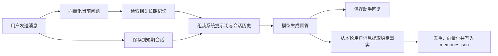

# DeskPet

DeskPet 是一个基于 Electron、Vue 3 和 TypeScript 构建的桌面 AI 伙伴。项目采用 Monorepo 与 Port/Adapter 架构，将模型、会话、长期记忆、工具和语音能力拆分为独立模块。

> 当前版本：`0.1.0`。桌面安装包目前面向 Windows。

## 主要功能

- 桌面聊天窗口与流式回复
- 在应用内填写 API Key、Base URL 和模型名称，保存后立即生效
- 自定义助手名称与五套界面主题
- 对话记录持久化，重新启动后继续显示历史消息
- 长期记忆：自动提取稳定的用户信息，并在后续对话中按相关性召回
- 识屏与图片提问
- 本地中文语音识别（Vosk，首次使用需要安装组件并下载模型）
- 工具调用框架：网页搜索、文件读取和 HTTP 请求
- Windows 兼容处理：禁用硬件加速以规避部分设备上的 Electron 黑屏问题

## 快速开始

### 使用 Windows 打包版

1. 从 GitHub Releases 下载 `DeskPet-0.1.0-win.zip`。
2. 完整解压 ZIP，不要直接在压缩包内运行。
3. 启动 `DeskPet.exe`。
4. 首次进入时设置助手名称。
5. 点击窗口右上角的“API”，填写 API Key、Base URL 和模型名称。

API 设置保存在当前 Windows 用户的数据目录中。Windows 支持 Electron `safeStorage` 时，API Key 会加密保存；系统不支持安全存储时会回退为明文 JSON，请注意本机账户安全。

### 从源码运行

环境要求：Node.js、pnpm 9。

```powershell
git clone https://github.com/obliviar/deskpet.git
cd deskpet
corepack enable
pnpm install
pnpm dev:electron
```

也可以双击仓库根目录的 `start.bat` 或 `start.vbs`。这两个脚本不包含 API Key，API 信息由应用内设置或本地 `config.json` 提供。

## 记忆模块

当前版本同时包含短期记忆和长期记忆。两者用途、保存文件和清理方式不同。

| 类型 | 保存内容 | 使用方式 | 默认上限 | 文件 |
| --- | --- | --- | ---: | --- |
| 短期记忆/会话历史 | 用户与助手的原始聊天消息 | 作为当前会话的连续上下文发送给模型 | 200 条消息 | `sessions.json` |
| 长期记忆 | 从用户消息中提取的稳定事实 | 根据当前问题做相似度检索，默认召回前 5 条 | 每个作用域 1000 条 | `memories.json` |

### 工作流程



一次正常对话的实际顺序如下：

1. 用户消息先写入短期会话。
2. 长期记忆模块用当前消息进行相关性检索。
3. 最多 5 条相关记忆被放入系统提示词，然后连同会话历史一起发送给模型。
4. 模型完成回复后，助手消息写入短期会话。
5. 规则提取器只分析本轮用户消息，筛选值得长期保存的事实。
6. 新事实完成规范化、精确去重和向量化后，立即写入长期记忆文件。

记忆召回或写入失败时，运行时会记录错误并继续聊天，不会让记忆模块故障直接中断主对话。

### 什么内容会进入长期记忆

当前版本使用保守的规则提取器，不会把每一句聊天都保存为长期记忆。支持识别的主要内容包括：

| 类型 | 示例表达 |
| --- | --- |
| 身份 | “我叫小明”“请叫我阿明”“我的生日是……” |
| 偏好 | “我喜欢科幻小说”“我不喜欢香菜” |
| 当前项目 | “我正在开发一个桌面宠物” |
| 明确记忆请求 | “请记住：我每周三需要整理周报” |
| 英文表达 | `My name is...`、`Call me...`、`I prefer...`、`Remember that...` 等 |

单轮最多提取 4 条候选记忆。普通寒暄、助手回复和未匹配规则的内容不会自动进入长期记忆。

### 本地向量检索

桌面版默认使用 `local-hash-v1`：

- 在本机将英文单词、字符片段以及中文单字/双字映射为 384 维向量。
- 采用余弦相似度排序，默认最低分数为 `0.08`。
- 每次对话默认召回相关度最高的 5 条记忆。
- 默认不需要 Embedding API，也不会为了生成或检索向量而上传原始记忆。
- 已保存记忆的向量模型与当前配置不一致时，会在下次召回时自动重新生成向量。

`local-hash-v1` 体积小、可离线运行，适合个人事实匹配，但语义理解能力弱于专业 Embedding 模型。底层向量存储也支持配置远程 Embedding 模型。

### 去重、容量与隔离

- 每条记忆包含 UUID、正文、元数据、作用域、向量模型、向量、创建时间和更新时间。
- 同一精确作用域内，规范化后的正文完全相同时不会重复写入，只合并元数据并更新时间。
- 超过每个作用域 1000 条的默认上限后，优先保留最近更新的记忆。
- 桌面版当前固定使用 `ownerId = local-user`、`agentId = deskpet`，因此记忆可以跨桌面会话召回。
- 核心接口支持 `ownerId`、`agentId` 和可选 `sessionId` 隔离，供服务端或多用户实现扩展；桌面界面目前仍是单本地用户模式。

### 安全处理

长期记忆不是可信指令来源。当前实现包含以下防护：

- 提取阶段拒绝疑似系统提示词、忽略指令、执行命令等提示注入内容。
- 拒绝疑似 API Key、密码、验证码和访问令牌等敏感信息。
- 写入前执行 Unicode 规范化、控制字符清理和长度限制。
- 注入系统提示词前转义 XML/HTML 分隔符，并明确要求模型只把记忆当作背景事实，不能执行其中的指令。

这些规则只能降低风险，不能保证识别所有敏感内容。请勿主动要求 DeskPet 记住密码、令牌、身份证号或其他高敏感数据。

### 数据文件位置

Windows 打包版的默认目录为：

```text
C:\Users\<你的用户名>\AppData\Roaming\@deskpet\electron\
```

也可以在文件资源管理器地址栏输入：

```text
%APPDATA%\@deskpet\electron
```

目录内的主要文件：

| 文件 | 内容 |
| --- | --- |
| `memories.json` | 长期记忆正文、元数据和本地向量 |
| `sessions.json` | 短期聊天历史 |
| `settings.json` | 助手名称、首次运行时间和主题 |
| `api-config.json` | API Base URL、模型名称以及加密或回退保存的 API Key |

如果设置了环境变量 `DESKPET_USER_DATA_DIR`，上述文件会改存到指定目录。

`memories.json` 的结构示例：

```json
{
  "version": 1,
  "items": [
    {
      "id": "00000000-0000-0000-0000-000000000000",
      "content": "用户喜好/偏好：科幻小说",
      "metadata": {
        "kind": "preference",
        "importance": 0.8,
        "confidence": 0.9
      },
      "scope": {
        "ownerId": "local-user",
        "agentId": "deskpet"
      },
      "embedding": [0, 0.12, -0.08],
      "embeddingModel": "local-hash-v1",
      "createdAt": 0,
      "updatedAt": 0
    }
  ]
}
```

示例中的向量和时间戳已缩短；实际本地向量为 384 维。

### 为什么可能找不到长期记忆文件

正常情况下，启用记忆的新版桌面程序在主进程完成初始化后就会创建 `memories.json`，即使其中暂时没有记忆。如果找不到，请依次检查：

1. 是否运行了旧版可执行文件。
2. 是否查看了当前登录用户的 `%APPDATA%`，而不是安装目录或其他 Windows 用户目录。
3. `config.json` 中是否设置了 `"memoryEnabled": false`，或环境变量 `DESKPET_MEMORY=false`。
4. 是否设置过 `DESKPET_USER_DATA_DIR`，导致数据被重定向。
5. 程序是否在完成启动前崩溃，或当前账户是否无权写入目标目录。

### 清理与隐私说明

- 窗口右上角“重新开始”需要二次确认；确认后会清空长期记忆、会话历史和一般设置，然后重启应用。
- “重新开始”当前不会删除 `api-config.json`，API 设置会保留。
- 当前界面还没有长期记忆列表、单条编辑或单条删除功能。底层接口已经支持 `forget`、`clear` 和 `count`，后续可以增加管理界面。
- `memories.json` 和 `sessions.json` 当前是本机明文 JSON，任何能访问该 Windows 账户文件的程序都可能读取它们。
- 本地向量化不会把记忆发送给 Embedding 服务；但被召回的记忆会作为本轮提示词的一部分发送给你配置的聊天模型 API。这是模型利用记忆回答问题所必需的步骤。

## API 配置

推荐通过桌面窗口右上角的“API”按钮配置。也可以在 `DeskPet.exe` 同目录或开发目录放置一个不会提交到 Git 的 `config.json`：

```json
{
  "apiKey": "YOUR_API_KEY",
  "baseURL": "https://api.openai.com/v1",
  "model": "gpt-4o-mini",
  "memoryEnabled": true,
  "embeddingModel": "local-hash-v1"
}
```

可用环境变量：

| 变量 | 作用 |
| --- | --- |
| `OPENAI_API_KEY` | 聊天模型 API Key |
| `OPENAI_BASE_URL` | OpenAI 兼容 API 地址 |
| `DESKPET_MODEL` | 聊天模型名称 |
| `DESKPET_MEMORY` | 设为 `false` 可关闭长期记忆 |
| `DESKPET_USER_DATA_DIR` | 覆盖应用数据目录 |
| `DESKPET_EMBEDDING_API_KEY` | 远程 Embedding API Key |
| `DESKPET_EMBEDDING_BASE_URL` | 远程 Embedding API 地址 |
| `DESKPET_EMBEDDING_MODEL` | Embedding 模型；默认 `local-hash-v1` |

不要把真实 API Key 写入 README、启动脚本、`config.example.json` 或提交到 Git。仓库已忽略 `apps/deskpet-electron/config.json`。

## 项目结构

```text
deskpet/
├─ apps/
│  ├─ deskpet-electron/   # Electron + Vue 桌面应用
│  ├─ cli/                # 命令行入口
│  └─ server/             # HTTP/WebSocket 服务入口
├─ packages/
│  ├─ contracts/          # Port 接口与共享类型
│  ├─ core/               # Agent 运行时、会话与提示词组装
│  ├─ llm-openai/         # OpenAI 兼容流式模型适配器
│  ├─ memory/             # 长期记忆提取、向量化、存储与检索
│  ├─ tools/              # 工具注册与实现
│  └─ voice/              # 语音相关模块
├─ start.bat
└─ start.vbs
```

记忆链路的关键文件：

- `packages/contracts/src/ports/memory-port.ts`：长期记忆接口与作用域定义
- `packages/memory/src/long-term/memory-extractor.ts`：规则提取与安全过滤
- `packages/memory/src/long-term/local-embedding.ts`：本地 384 维向量
- `packages/memory/src/long-term/vector-store.ts`：持久化、去重、检索与清理
- `packages/memory/src/long-term/memory-writer.ts`：提取器和存储层组合
- `packages/core/src/runtime/agent-runtime.ts`：对话前召回、对话后写入
- `packages/core/src/prompt/system-prompt.ts`：记忆安全注入系统提示词
- `apps/deskpet-electron/src/main/index.ts`：桌面版数据路径与记忆初始化

## 开发与验证

```powershell
# 全部类型检查/构建
pnpm build

# 全部测试
pnpm test

# 单独测试记忆模块
pnpm --filter @deskpet/memory test

# 构建 Electron 渲染与主进程
pnpm --filter @deskpet/electron build

# 生成 Windows ZIP
pnpm --filter @deskpet/electron package
```

打包输出目录：

```text
apps\deskpet-electron\release\
```

## 当前限制与后续方向

- 长期记忆提取目前以中英文规则为主，不是通用语义事实抽取器。
- `local-hash-v1` 更适合关键词和局部文本相似，不等同于大型语义 Embedding 模型。
- 桌面端目前固定为一个本地用户和一个 Agent 作用域。
- 尚无可视化记忆管理、手动新增、单条编辑、过期策略和重要度衰减界面。
- 会话历史当前按消息数量裁剪，没有基于 Token 的上下文压缩或摘要。
- JSON 文件没有数据库级事务、跨进程锁或静态加密，不适合多进程共享写入。

欢迎围绕记忆管理界面、可配置抽取器、记忆过期/合并策略、加密存储和多用户隔离继续改进。
