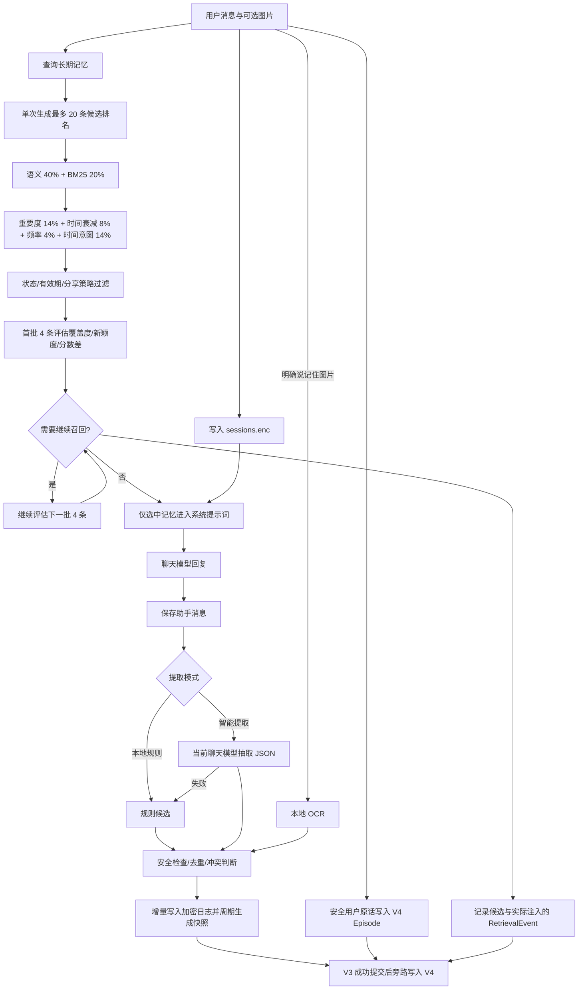

# DeskPet

DeskPet 是一个基于 Electron、Vue 3 和 TypeScript 的 Windows 桌面 AI 伙伴。项目采用 Monorepo 与 Port/Adapter 架构，将聊天模型、会话、长期记忆、工具和语音能力拆分为独立模块。

> 当前版本：`0.3.6`。本版为 V4 影子召回接入了经校验的本地 BGE 向量、独立加密语义索引和后台增量重建；V3 仍是正式回答来源。

## 主要功能

- 桌面聊天窗口、流式回复和对话历史
- 在应用内填写 API Key、Base URL 和模型名称
- 自定义助手名称与五套界面主题
- 记忆 v2：规则/智能事实提取、混合检索、冲突和过期管理、来源同步
- AES-256-GCM 加密长期记忆，主密钥由 Electron `safeStorage`/Windows DPAPI 保护
- 可选中文本地语义模型 `Xenova/bge-small-zh-v1.5`
- 明确请求时才执行的本地图片 OCR 记忆
- 逐条控制记忆的重要度、敏感级别和远程分享策略
- 识屏提问、本地中文语音识别和工具调用框架
- 禁用硬件加速，规避部分 Windows 设备上的 Electron 黑屏

## 快速开始

### Windows 打包版

1. 下载并完整解压 `DeskPet-0.3.6-win.zip`。
2. 启动 `DeskPet.exe`，不要直接在 ZIP 内运行。
3. 首次进入时设置助手名称。
4. 点击右上角“API”，填写 API Key、Base URL 和模型名称。
5. 点击“🧠 记忆”查看或调整方案 A。

打包版默认使用便携数据目录：

```text
<DeskPet.exe 所在目录>\DeskPetData\
```

因此新版本不会默认把聊天、模型和长期记忆写到 C 盘的 AppData。移动整个解压目录时，应用数据也会随之移动。

### 从源码运行

要求 Node.js 和 pnpm 9：

```powershell
git clone https://github.com/obliviar/deskpet.git
cd deskpet
corepack enable
pnpm install
pnpm dev:electron
```

开发模式仍采用 Electron 的开发数据目录。可设置 `DESKPET_USER_DATA_DIR` 指向独立测试目录，避免读写真实数据。

## 记忆模块：方案 A

DeskPet 同时保留短期会话和长期记忆：

> V4 安全双写和隔离影子召回已经启用，但尚未接管正式回答。V3 仍是唯一正式读写与回滚来源；每次 V3 成功提交后，V4 旁路同步 Episode、Candidate、Fact、EvidenceLink、FactVersion 和 RetrievalEvent。V4 在独立 Worker 中用 BM25、结构化字段、摘要下钻、本地哈希和可选的已校验 BGE 向量产生候选，只用于与 V3 结果比较和内部评估。任何 V4、向量索引或 Worker 故障都会回退，不会中断 V3。

| 类型 | 保存内容 | 用途 | 文件 |
| --- | --- | --- | --- |
| 短期会话 | 用户和助手的原始消息 | 保持当前对话连续性，默认最多 200 条 | `sessions.enc` |
| 长期记忆 v3 | 原子事实、时间版本、来源、向量和隐私字段 | 跨会话及历史时间召回，默认最多 20,000 条 | `memories.enc` + `memories.enc.journal` |
| V4 影子记忆 | 事实图、证据、版本、摘要、检索事件和冷热层级 | 双写审计、离线巩固和候选质量评估，不直接进入回答 | `memory-v4.enc` + `memory-v4.enc.journal` |
| V4 学习语义索引 | 与精确正文哈希绑定的 BGE 事实/摘要向量 | 在隔离 Worker 中增强改写和同义表达召回 | `memory-v4-embeddings.enc` |

### 完整工作流程



召回或写入失败不会中断主对话。初始化或解密失败时，程序不会创建空文件覆盖旧数据，而是关闭长期记忆并在管理窗口显示错误。

### 自适应召回

桌面聊天默认不再固定注入 Top 5。检索器只生成一次候选排名，然后先评估前 4 条；如果问题涉及多个主题、历史变化、全部偏好或个人信息总结，则继续评估后续批次。单值问题在目标字段已经覆盖后立即停止。

默认策略为候选池最多 20 条、每批 4 条、最多 3 批、最多注入 10 条，并使用约 2400 个规范化正文字符的软预算。停止依据包括目标字段覆盖、排名分数骤降、后续批次信息增益、重复度、注入数量和正文预算。隐私与时间过滤发生在候选排名之前；只有最终进入提示词的记忆会增加召回次数，被评估但未注入的候选不会影响未来排名。

Port 层仍保留固定 `recall(topK)`；调用方显式传入 `memoryTopK` 时使用旧的固定数量行为，未传入时使用自适应召回。

### V4 安全双写与回滚边界

- V3 持久化成功后才通知 V4；V4 回调、事务或加密文件失败不会让 V3 操作失败。
- V4 将新增、重复合并、替代、冲突、来源解除、过期、手动更新、恢复、删除和清空保存为事实状态及版本历史。
- 删除在 V4 中使用 `deleted` 墓碑并停用证据，不再参与未来召回，同时保留审计链。
- 捕获到原始用户消息时，候选事实会连接到原生 Episode 和直接 Evidence；整段消息必须通过密钥/指令安全检查，并独立执行隐私推断。
- 自适应召回分别记录已评估事实与实际注入事实，查询正文只保存 SHA-256 哈希。
- 启动对账使用线性映射索引；5000 条模拟 V3 记录首次对账约 393 ms，未变化重启约 46 ms（测试机器结果，不是性能保证）。
- V4 影子检索在独立 Worker 中运行；超时、模型不匹配、索引损坏或语义查询失败时安全退回哈希/BM25 路径，聊天提示词继续只使用经过验证的 V3 召回结果。

### 长期优化计划表

状态只在实现完成并通过对应测试后更新。`√` 表示已完成，`×` 表示未完成：

| 状态 | 阶段 | 优化成果 / 验收门槛 |
| --- | --- | --- |
| √ | 基线与 V3 基础能力 | 加密、增量日志、来源同步、生命周期、冲突、隐私和记忆管理已上线 |
| √ | V4 第一阶段数据底座 | 独立模型、事务 Repository、严格校验、加密快照和只读 V3→V4 迁移已完成 |
| √ | 自适应分批召回 | 动态批次、覆盖/增益/分数停止、数量和字符预算已上线 |
| √ | V4 第二阶段安全双写 | 提交后双写、原始证据、版本历史、删除墓碑、召回事件、启动对账和故障隔离已完成；V4 尚不参与召回 |
| √ | 双写差异审计 | 已逐项核对计数、正文、状态、作用域、有效时间、来源、隐私和版本头；隔离应用测试达到 100.0000% exact、0 issues |
| √ | V4 隔离影子召回 | 独立 Worker、多路 RRF、BM25、结构化查询、摘要导航、绝对证据门槛、拒答和持久化对比已完成；不影响正式回答 |
| √ | V4 学习语义旁路 | 固定指纹 BGE、SHA-256 模型清单、启动探针、V3 向量复用、独立加密索引、后台增量补齐、内容哈希校验和哈希降级已完成 |
| × | 高质量写入门控（3/8） | 已上线双通道候选、本地证据 verifier 和七类写入决策；低证据/冲突候选不进入 V3 正式召回并在 V4 隔离，完整上下文、归一化、审核和重处理仍待完成 |
| × | 时间与冲突演化 | 完整处理补充、纠正、替代、冲突和历史时间查询 |
| × | 分层巩固与遗忘 | 日/周/月摘要、稳定事实、事件层和可恢复冷归档 |
| × | 大规模多层检索（4/5） | 已有冷热分层、精确密集向量、BM25、哈希、时间/字段检索和摘要下钻；待真实 BGE 冻结集校准后才能成为正式召回 |
| × | 反馈学习和可解释管理 | 使用 RetrievalEvent 改进排序，并在界面显示来源、版本、可信度与召回原因 |
| × | 长周期可靠性与隐私 | 备份恢复、文件锁、故障注入、隐私泄漏评测和一年尺度模拟 |
| × | V4 灰度切换与一年验收 | 质量门槛达标后小比例召回，可立即回退 V3，最终完成一年记忆验收 |

### 事实提取

管理窗口可选择两种模式：

- **本地规则**：识别姓名、称呼、生日、偏好、厌恶、当前项目和“请记住……”等中英文表达。无需额外 API 调用，稳定且可预测。
- **智能提取**：使用当前配置的聊天模型，把本轮用户原话转换为严格 JSON。只把明确陈述、未来仍有用的事实作为候选；不把助手回复当作证据。接口失败、返回格式错误或未配置 API 时自动退回本地规则。

所有候选还会经过指令注入、密钥、密码和令牌检查。智能提取会向当前配置的模型服务发送本轮用户原话；如果不希望发生这项额外请求，请使用“本地规则”。

### 混合检索与本地语义模型

默认检索器是无需下载的 `local-hash-v2`。它在字符哈希上增加本地语义字段别名，并由 BM25 词语检索配合相关性门控，综合六项分数：

| 信号 | 权重 |
| --- | ---: |
| 本地向量相似度 | 40% |
| BM25 词语匹配 | 20% |
| 用户设定的重要度 | 14% |
| 最近更新时间 | 8% |
| 历史召回频率 | 4% |
| 当前/历史时间意图匹配 | 14% |

结果还会做近重复抑制，避免相似内容占满前 5 条。

在“🧠 记忆”中点击“下载并启用”，可以安装固定 revision 的 `Xenova/bge-small-zh-v1.5` q8 ONNX 模型。模型下载到 `DeskPetData\models\memory`，不随 Git 仓库或安装 ZIP 分发。安装后必须通过逐文件 SHA-256 清单、运行时身份、512 维归一化和重复探针校验；不通过则关闭学习语义路径并继续使用本地哈希。

V3 会先在后台补齐旧记忆的 BGE 向量，再切换正式 V3 语义检索。V4 使用自己的 `memory-v4-embeddings.enc`：启动时复用内容一致的 V3 向量，随后以小批次补齐 V4 事实和摘要；事实 revision 与语义 revision 分开同步给隔离 Worker。Worker 只接受模型指纹、维度、正文哈希和快照 revision 全部匹配的向量。当前 20,000 条、512 维精确索引压力门禁在测试机上的 P95 为约 11.18 ms（不是所有设备的性能保证）。

### 生命周期、冲突与聊天来源

每条 v3 记忆都有状态，并可使用 `validFrom`、`validTo` 表示事实在现实中的有效区间：

| 状态 | 含义 | 是否参与召回 |
| --- | --- | --- |
| `active` | 当前有效 | 是 |
| `superseded` | 被更可信的新单值事实替代 | 仅历史查询 |
| `expired` | 已超过有效期 | 否 |
| `conflicted` | 新旧事实冲突但置信度不足 | 否 |
| `orphaned` | 自动记忆的最后一条聊天证据已删除 | 否 |

姓名、生日、所在地等可以带稳定 `memoryKey` 和 `single` 基数。置信度不低于 0.8 的新值会关闭旧事实的有效区间并将其标记为 `superseded`；“以前、曾经、2024 年”等查询仍可召回对应历史版本。置信度不足时，新事实进入 `conflicted`，等待用户在管理窗口决定。

自动记忆记录来源消息 ID。使用聊天回退功能删除消息时，DeskPet 会同步解除来源关联；失去全部来源的自动/图片记忆会变为 `orphaned`，不会再被召回。手动添加的记忆不受聊天删除影响。用户可以恢复失效记忆或永久删除。

### 图片记忆

图片不会因为普通识屏提问自动进入长期记忆。只有同时满足以下条件才会运行 OCR：

1. 本轮带有图片或截图；
2. 用户明确说“记住图片/截图/照片”等同义表达；
3. “显式图片记忆”开关已启用。

OCR 使用 Tesseract.js 的简体中文和英文模型，在本机执行。只保存提取后的文字与附件哈希，不保存原始图片。首次使用可能需要下载语言数据到 `DeskPetData\models\ocr`。图片记忆默认标为 `private + local-only`。

### 隐私与远程分享

长期记忆正文在静态存储时使用 AES-256-GCM 加密。`memory-key.json` 只保存经过 Windows DPAPI 保护的随机主密钥；若系统安全存储不可用，长期记忆会拒绝启动，不会降级成明文。

每条记忆有两组控制：

- 敏感级别：`normal`、`private`、`secret`
- 分享策略：`allow-remote`、`local-only`、`ask`

全局远程策略可选：

- **仅普通且允许分享**：默认设置，只发送 `normal + allow-remote`。
- **允许已授权的隐私记忆**：还可发送用户明确设为 `allow-remote` 的 `private` 记忆。
- **完全不发送长期记忆**：仍在本机提取和管理，但本轮聊天提示词不附带任何长期记忆。

`secret` 永远不会随聊天请求发送；`local-only` 和 `ask` 也不会发送。这里的“本地向量/OCR”只表示检索和 OCR 在本机运行，不代表聊天本身不访问用户配置的模型服务。

### 可视化管理

“🧠 记忆”窗口支持：

- 查看有效、替代、过期、冲突和来源失效的全部记录；
- 查看类型、更新时间和召回次数；
- 手动添加、安全校验、二次确认永久删除和清空；
- 调整每条记忆的重要度、敏感级别和分享策略；
- 恢复失效记录；
- 切换提取、远程分享、图片 OCR 和语义模型；
- 查看实际加密文件位置。

记忆正文目前不能原地编辑；需要修改时可删除旧记录并手动添加新记录。

## 数据文件与迁移

Windows 打包版主要数据位于：

```text
<DeskPet.exe 所在目录>\DeskPetData\
├─ memories.enc          # AES-256-GCM 加密长期记忆 v3 快照
├─ memories.enc.journal  # 独立认证加密的增量操作日志
├─ memories.enc.pre-v3.backup # 首次 V3 迁移前的加密备份
├─ memory-key.json       # DPAPI 保护后的随机主密钥
├─ memory-v4.enc         # 第二阶段双写、证据与召回审计的 V4 加密影子快照
├─ memory-v4-key.json    # V4 独立的 DPAPI 保护密钥
├─ memory-v4-embeddings.enc # V4 事实/摘要的加密 BGE 派生索引
├─ memory-v4-embedding-key.json # V4 语义索引的 DPAPI 保护密钥
├─ memory-settings.json  # 提取、语义、OCR 和分享设置
├─ sessions.enc          # AES-256-GCM 加密短期聊天历史
├─ session-key.json      # DPAPI 保护后的会话主密钥
├─ settings.json         # 名称、首次运行与主题
├─ api-config.json       # API 地址、模型和受系统保护的 API Key
└─ models\               # 可选语义模型、OCR 和语音资源
```

升级时若同一数据目录存在旧版 `memories.json` 且尚无 `memories.enc`，程序会：

1. 读取旧 v1 JSON；
2. 使用新随机主密钥加密；
3. 立即解密并逐字节校验；
4. 将索引迁移为 v3，并补充时间版本字段；
5. 仅在验证成功后删除旧明文文件。

从已有加密 V1/V2 索引升级时，程序会先生成 `memories.enc.pre-v3.backup`，备份仍为密文；随后才写入 V3。正常写入只追加 `memories.enc.journal`，达到 500 条操作或约 16 MB 后自动压缩回新快照。无法解密时不要删除 `memory-key.json`，否则快照、日志和迁移备份都无法恢复。

可用环境变量：

| 变量 | 作用 |
| --- | --- |
| `OPENAI_API_KEY` | 聊天模型 API Key |
| `OPENAI_BASE_URL` | OpenAI 兼容 API 地址 |
| `DESKPET_MODEL` | 聊天模型名称 |
| `DESKPET_MEMORY=false` | 关闭长期记忆 |
| `DESKPET_USER_DATA_DIR` | 覆盖应用数据目录，测试时推荐使用 |
| `DESKPET_BOOT_LOG` | 将启动诊断写入指定文件 |

也可以在 `DeskPet.exe` 同目录或开发目录放置不会提交到 Git 的 `config.json`：

```json
{
  "apiKey": "YOUR_API_KEY",
  "baseURL": "https://api.openai.com/v1",
  "model": "gpt-4o-mini",
  "memoryEnabled": true
}
```

不要把真实 API Key 写入 README、脚本、示例配置、备份 ZIP 或 Git。仓库已忽略 `apps/deskpet-electron/config.json`。

## 项目结构与关键文件

```text
deskpet/
├─ apps/deskpet-electron/              # Electron + Vue 桌面应用
├─ apps/cli/                           # CLI 入口
├─ apps/server/                        # 服务端入口
├─ packages/contracts/                 # Port 接口与共享类型
├─ packages/core/                      # Agent 运行时、会话、提示词
├─ packages/llm-openai/                # OpenAI 兼容模型适配器
├─ packages/memory/                    # 长期记忆方案 A
├─ packages/tools/                     # 工具注册与实现
└─ packages/voice/                     # 语音模块
```

记忆链路的关键文件：

- `packages/contracts/src/ports/memory-port.ts`：记忆 v2 接口、生命周期和来源同步
- `packages/memory/src/long-term/memory-extractor.ts`：本地规则与安全过滤
- `packages/memory/src/long-term/smart-memory-extractor.ts`：结构化智能提取与回退
- `packages/memory/src/long-term/local-embedding.ts`：本地哈希向量
- `packages/memory/src/long-term/dense-vector-candidate-index.ts`：BGE 密集向量精确候选索引
- `packages/memory/src/long-term/vector-store.ts`：混合排序、冲突、生命周期与迁移
- `packages/memory/src/long-term/encrypted-persistence.ts`：AES-256-GCM 文件适配器
- `packages/memory/src/v4/dual-write/v4-shadow-writer.ts`：V3 提交后双写、证据连接、版本和召回审计
- `packages/memory/src/v4/retrieval/memory-v4-shadow-retriever.ts`：V4 多路召回、学习语义、融合和拒答
- `packages/core/src/runtime/agent-runtime.ts`：召回、附件和来源 ID
- `apps/deskpet-electron/src/main/semantic-memory.ts`：本地中文语义模型
- `apps/deskpet-electron/src/main/memory-v4-semantic-index.ts`：V4 加密语义索引、迁移和后台增量重建
- `apps/deskpet-electron/src/main/memory-v4-shadow-worker.ts`：隔离 V4 影子召回 Worker
- `apps/deskpet-electron/src/main/image-memory.ts`：显式图片 OCR
- `apps/deskpet-electron/src/main/index.ts`：加密初始化、隐私过滤和 IPC
- `apps/deskpet-electron/src/renderer/src/App.vue`：记忆管理界面

## 开发与验证

```powershell
# 全仓库类型检查/构建
pnpm build

# 全仓库测试
pnpm test

# 记忆模块测试
pnpm --filter @deskpet/memory test

# Electron 主进程和 Vue 类型检查
pnpm --filter @deskpet/electron exec tsc --noEmit -p tsconfig.node.json
pnpm --filter @deskpet/electron exec vue-tsc --noEmit -p tsconfig.web.json

# Electron 记忆冷迁移、双写对账、重启保留、损坏降级与渲染启动烟雾测试
pnpm --filter @deskpet/electron test:smoke

# 构建和生成 Windows ZIP
pnpm --filter @deskpet/electron build
pnpm --filter @deskpet/electron package
```

输出目录：`apps\deskpet-electron\release\`。

## 当前限制

- 智能提取的质量取决于当前聊天模型及其 JSON 输出能力；异常时会回退规则。
- 本地语义模型和 OCR 语言数据需要首次联网下载，未内置到安装 ZIP。
- 短期会话与长期记忆均已加密；DPAPI 密钥与数据文件必须一起备份。
- 当前桌面端固定为一个本地用户和一个 Agent 作用域。
- V4 已执行隔离影子召回和内部评估，但没有进入聊天提示词；学习语义分数仍需用真实 BGE 冻结集正式校准后才能灰度接管回答。
- 本次代码回归未执行外部盲测；本机也没有 BGE 模型缓存，因此真实 BGE 开发集对比未执行，不能把合成集成绩视作上线质量证明。
- 尚无多进程文件锁、正文原地编辑和分层的日/周/月会话摘要。
- OCR 只保留可识别文字，无法完整理解没有文字的图片语义。
